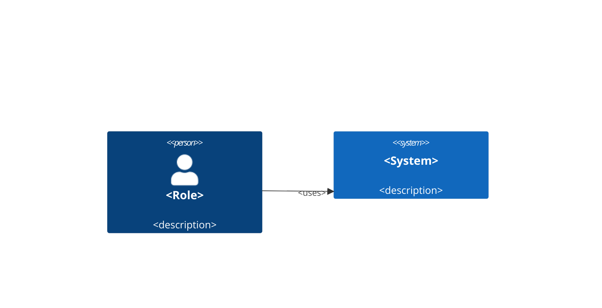
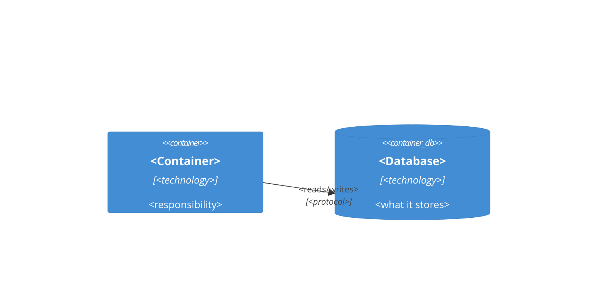
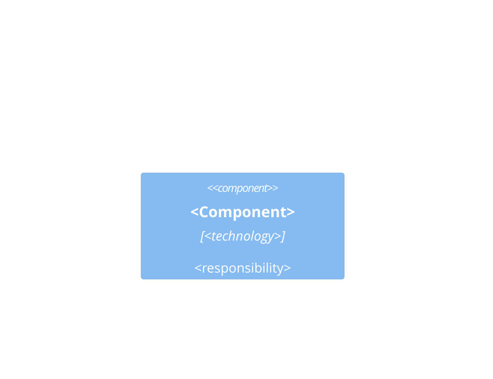

# BA Mission Plan (C4) Implementation Plan

> **For agentic workers:** REQUIRED SUB-SKILL: Use superpowers:subagent-driven-development (recommended) or superpowers:executing-plans to implement this plan task-by-task. Steps use checkbox (`- [ ]`) syntax for tracking.

**Goal:** Add an epic-level Mission Plan authoring flow upstream of `ba-ticket-author` — C4 L1/L2 diagrams plus a US backlog, gated by a new `kb mission lint`, with the epic→story link enforced downstream at ticket lint.

**Architecture:** Shared lint primitives move out of `ticketlint.py` into a new `lintcore.py`; `missionlint.py` is a second thin engine over them. `kb mission lint` is a Typer sub-app mirroring `kb ticket lint`. A new skill `ba-mission-plan` and a mission template scaffold on `kb init --kind ba` only. **No new MCP tool** — the count stays at 5.

**Tech Stack:** Python 3.12+, Typer (CLI), pytest (hermetic tests, `fed_hub` git fixture), pydantic (config), FastMCP (existing server — untouched here).

**Spec:** `docs/superpowers/specs/2026-07-28-ba-mission-plan-design.md` (canonical). Vietnamese reading copy: same name with `.vi.md`.

## Global Constraints

- **`ticket.REQUIRED_HEADINGS` must not change.** It is a compatibility contract across local install / shared MCP server / CI. A task that adds a heading to it is wrong (spec §3.3).
- **The four core MCP tools are untouched**, and **no MCP tool is added**. Tool count stays at exactly 5 (spec §3.1, §9).
- **`REQUIRED_MISSION_HEADINGS` carries breaking-change discipline** once shipped: minor/major release only, changelog entry mandatory (spec §3.6).
- **English headings are fixed** (the lint contract); ticket and mission body text follows the BA's working language. UTF-8 throughout via the existing `utf8io` module — Vietnamese bodies and `§` must work on Windows consoles.
- **A skipped check is never silently a passed check.** Any check that cannot run because a path was not supplied emits a note (spec §5.1).
- **Tests are hermetic:** no live hub, no network, no LLM. Use the existing `fed_hub` fixture from `tests/conftest.py`, which publishes exactly `arinc-kb:arinc-424 §5.3` and `icao-kb:icao-annex-2 §1.1`.
- **Nothing is added to hub or child scaffolds.** Everything new scaffolds on `kb init --kind ba` only.
- Style: PEP 8, type annotations on all signatures, `from __future__ import annotations` at the top of every new module (matches every existing module in `src/center_kb/`).
- Commit after every task. Conventional-commit types: `feat`, `fix`, `refactor`, `docs`, `test`, `chore`.

## File Structure

| File | Responsibility |
|---|---|
| `src/center_kb/lintcore.py` (new) | Lint primitives shared by both DoR gates. Knows nothing about ticket or mission heading contracts — callers pass their own constants in. |
| `src/center_kb/mission.py` (new) | The mission template contract: heading list, id formats, backlog table regexes, diagram keyword sets. Constants only, no logic. |
| `src/center_kb/missionlint.py` (new) | `kb mission lint` engine. Mission-specific checks + assembly. |
| `src/center_kb/ticketlint.py` (modify) | Loses the shared helpers, keeps ticket-specific checks, gains the parent-mission check. |
| `src/center_kb/ticket.py` (modify) | Gains `PARENT_MISSION_RE`. `REQUIRED_HEADINGS` untouched. |
| `src/center_kb/cli.py` (modify) | New `kb mission` Typer sub-app with one `lint` command. |
| `src/center_kb/initcmd.py` (modify) | `BA_TEMPLATES` gains six entries; `tickets-gitkeep.txt` renamed `gitkeep.txt`. |
| `src/center_kb/templates/init/` (new files) | `mission-template.md`, four `ba-mission-plan` wrappers, `gitkeep.txt`. |
| `src/center_kb/templates/init/kb-ticket-lint.yml` (modify) | Covers `missions/**.md` too. Filename and job name frozen. |
| `tests/test_missionlint.py`, `tests/test_cli_mission.py` (new) | Mission engine and CLI coverage. |

---

### Task 1: Extract `lintcore.py` and add the notes channel

Behaviour-preserving refactor plus one additive field.

**Acceptance condition:** the existing `tests/test_ticketlint.py` and `tests/test_cli_ticket.py` suites pass with **exactly one permitted edit** — `test_to_json_shape`, which asserts the JSON envelope's exact key set, gains `"notes"`. Spec §5.1 requires `--json` to emit `{"pass", "errors", "warnings", "notes"}`, so widening that one assertion records an intended contract change. Every other test in both files must pass untouched; editing any of them means the extraction diverged.

**Files:**
- Create: `src/center_kb/lintcore.py`
- Modify: `src/center_kb/ticketlint.py` (replaces most of the file)
- Test: `tests/test_ticketlint.py` (must pass unchanged), `tests/test_lintcore.py` (new, for the notes channel)

**Interfaces:**
- Consumes: `center_kb.doctor.Issue`, `center_kb.doctor.check_context`, `center_kb.kbcontext.parse`, `center_kb.kbcontext.KBContext`, `center_kb.kbcontext.KBRef`
- Produces: `lintcore.LintReport(issues: list[Issue], notes: list[str])`, `lintcore.section_body(text, heading) -> str | None`, `lintcore.check_title(text) -> list[Issue]`, `lintcore.check_headings(text, required: tuple[str, ...]) -> list[Issue]`, `lintcore.check_diagram(text, heading, keywords: tuple[str, ...]) -> list[Issue]`, `lintcore.check_context_block(text, hub) -> tuple[list[Issue], KBContext | None]`, `lintcore.INLINE_CITE_RE`, `lintcore.FENCE_RE`, `lintcore.TITLE_RE`

- [ ] **Step 1: Confirm the baseline is green before touching anything**

Run: `.venv/bin/pytest tests/test_ticketlint.py tests/test_cli_ticket.py -q`
Expected: all pass. Record the count — the same count must pass at the end of this task.

- [ ] **Step 2: Create `src/center_kb/lintcore.py`**

Every function below is moved verbatim from `ticketlint.py` except where noted in the docstrings.

```python
"""Lint primitives shared by the BA Definition-of-Ready gates.

`ticketlint.py` (`kb ticket lint`) and `missionlint.py` (`kb mission
lint`) are both thin layers over these checks. No CLI/MCP dependencies
here, and nothing in this module knows the ticket or mission heading
contracts — callers pass their own constants in.
"""

from __future__ import annotations

import re
from dataclasses import dataclass, field
from typing import TYPE_CHECKING

from center_kb import kbcontext
from center_kb.doctor import Issue, check_context
from center_kb.kbcontext import KBContext, KBRef

if TYPE_CHECKING:
    from center_kb.hub import HubHandle

# A fenced code block: ```<lang>\n<content>```. Used both to find mermaid
# diagrams inside a section and to strip fences (mermaid + a fenced
# kb-context block) before scanning prose for inline citations.
FENCE_RE = re.compile(r"```[ \t]*(\S*)[ \t]*\r?\n(.*?)```", re.S)

# Inline citation '<doc-id> §<sec>' / '<repo:doc-id> §<sec>' — matches
# kbcontext._REF_RE semantics (repo qualifier optional, '§' required).
INLINE_CITE_RE = re.compile(
    r"(?:([A-Za-z0-9][\w.-]*):)?([A-Za-z0-9][\w.-]*)\s+§([^\s,;)\]]+)"
)

# The bare 'kb-context:' key line, at any indent (mirrors kbcontext._KEY_RE)
# — used to strip a kb-context block that was NOT wrapped in a ``` fence.
_KB_CTX_LINE_RE = re.compile(r"^(?P<indent>\s*)kb-context:\s*$")

# Level-1 title: the first non-empty line must start with a single '# '
# (not '## ' — that would be a level-2 heading).
TITLE_RE = re.compile(r"^#\s+\S")


@dataclass
class LintReport:
    """Issues plus notes. A note records a check that could NOT run —
    typically because the caller supplied no filesystem path. Notes never
    affect `passed`: they exist so a skipped check is never mistaken for
    a passed one."""

    issues: list[Issue]
    notes: list[str] = field(default_factory=list)

    @property
    def passed(self) -> bool:
        return not any(i.level == "error" for i in self.issues)

    def to_json(self) -> dict:
        return {
            "pass": self.passed,
            "errors": [i.message for i in self.issues if i.level == "error"],
            "warnings": [i.message for i in self.issues if i.level == "warning"],
            "notes": list(self.notes),
        }

    def render(self) -> str:
        """Mirror `kb doctor`'s output style: one '[error]'/'[warn]'/'[note]'
        line per item, final line 'DoR: PASS' or 'DoR: FAIL'."""
        lines = [
            f"[{'error' if i.level == 'error' else 'warn'}] {i.message}"
            for i in self.issues
        ]
        lines += [f"[note] {note}" for note in self.notes]
        lines.append(f"DoR: {'PASS' if self.passed else 'FAIL'}")
        return "\n".join(lines)


def section_body(text: str, heading: str) -> str | None:
    """Lines after an exact `heading` line, up to the next '# '/'## ' line."""
    lines = text.splitlines()
    start = None
    for i, line in enumerate(lines):
        if line.strip() == heading:
            start = i + 1
            break
    if start is None:
        return None
    end = len(lines)
    for j in range(start, len(lines)):
        if lines[j].startswith("## ") or lines[j].startswith("# "):
            end = j
            break
    return "\n".join(lines[start:end])


def check_title(text: str) -> list[Issue]:
    for line in text.splitlines():
        if not line.strip():
            continue
        if TITLE_RE.match(line):
            return []
        break
    return [
        Issue(
            "error",
            "missing level-1 title — the first non-empty line must start "
            "with '# '",
        )
    ]


def check_headings(text: str, required: tuple[str, ...]) -> list[Issue]:
    present = {line.strip() for line in text.splitlines()}
    return [
        Issue("error", f"missing required heading: '{heading}'")
        for heading in required
        if heading not in present
    ]


def check_diagram(
    text: str, heading: str, keywords: tuple[str, ...]
) -> list[Issue]:
    """The section must carry a ```mermaid fence in which one of `keywords`
    appears at the START OF A LINE.

    Anchoring at line start (rather than requiring the keyword to be the
    fence's very first token) lets a Mermaid init directive
    (`%%{init: ...}%%` on the line above) precede the diagram type, while
    still refusing to match the word 'flowchart' buried in a node label.
    """
    body = section_body(text, heading)
    if body is None:
        return []  # heading missing — already reported by check_headings
    pattern = re.compile(
        r"^[ \t]*(?:" + "|".join(re.escape(k) for k in keywords) + r")\b",
        re.M,
    )
    for lang, content in FENCE_RE.findall(body):
        if lang.strip().lower() == "mermaid" and pattern.search(content):
            return []
    joined = " or ".join(f"'{k}'" for k in keywords)
    return [
        Issue(
            "error",
            f"'{heading}' must contain a ```mermaid fence with {joined} "
            "at the start of a line",
        )
    ]


def strip_bare_kb_context(text: str) -> str:
    """Drop a 'kb-context:' block that isn't wrapped in a ``` fence."""
    lines = text.splitlines()
    out: list[str] = []
    i = 0
    while i < len(lines):
        m = _KB_CTX_LINE_RE.match(lines[i])
        if not m:
            out.append(lines[i])
            i += 1
            continue
        indent = len(m.group("indent"))
        i += 1
        while i < len(lines):
            line = lines[i]
            if not line.strip():
                i += 1
                continue
            if len(line) - len(line.lstrip()) <= indent:
                break
            i += 1
    return "\n".join(out)


def citation_scan_text(text: str) -> str:
    """Body text with all fenced code blocks (mermaid + a fenced kb-context
    block) and any unfenced kb-context block stripped, for inline-citation
    scanning — refs pinned in kb-context are not themselves "citations"."""
    return strip_bare_kb_context(FENCE_RE.sub("", text))


def cite_matches_ref(ref: KBRef, repo: str | None, doc: str, sec: str) -> bool:
    if doc != ref.doc_id or sec != ref.section_id:
        return False
    if repo is None:
        return True  # citation has no repo qualifier — matches any repo
    return repo == ref.repo_id


def check_citation_consistency(text: str, ctx: KBContext) -> list[Issue]:
    scan_text = citation_scan_text(text)
    citations = list(
        dict.fromkeys(
            (m.group(1), m.group(2), m.group(3))
            for m in INLINE_CITE_RE.finditer(scan_text)
        )
    )
    issues: list[Issue] = []
    for repo, doc, sec in citations:
        label = f"{repo}:{doc} §{sec}" if repo else f"{doc} §{sec}"
        if not any(cite_matches_ref(ref, repo, doc, sec) for ref in ctx.refs):
            issues.append(
                Issue(
                    "error",
                    f"citation '{label}' in the body is not in kb-context refs",
                )
            )
    for ref in ctx.refs:
        cited = any(
            cite_matches_ref(ref, repo, doc, sec) for repo, doc, sec in citations
        )
        if not cited:
            issues.append(
                Issue(
                    "warning",
                    f"kb-context ref '{ref}' is never cited in the body",
                )
            )
    return issues


def check_context_block(
    text: str, hub: "HubHandle | None"
) -> tuple[list[Issue], KBContext | None]:
    """Parse the kb-context block, resolve its refs at the pinned version,
    and cross-check inline citations against it. Returns the issues and the
    parsed context (None when the block did not parse, in which case the
    ref/citation checks are meaningless and are skipped)."""
    try:
        ctx = kbcontext.parse(text)
    except kbcontext.KBContextError as exc:
        return [Issue("error", str(exc))], None

    issues: list[Issue] = []
    if hub is None:
        issues.append(
            Issue(
                "error",
                "hub unreachable — cannot resolve kb-context refs "
                "without a hub",
            )
        )
    else:
        ctx_issues, _results = check_context(text, hub)
        issues += ctx_issues
    issues += check_citation_consistency(text, ctx)
    return issues, ctx
```

- [ ] **Step 3: Rewrite `src/center_kb/ticketlint.py` to sit on top of it**

Replace the whole file with this. Everything removed lives in `lintcore` now; `lint()` behaves identically.

```python
"""`kb ticket lint` engine — the Definition-of-Ready gate for BA tickets.

No CLI/MCP dependencies here: `cli.py`'s `kb ticket lint` command and the
`kb_ticket_lint` MCP tool are both thin wrappers over `lint()`. Shared
primitives live in `lintcore`; this module holds only what is specific to
the ticket contract.
"""

from __future__ import annotations

import re
from typing import TYPE_CHECKING

from center_kb import lintcore, ticket
from center_kb.doctor import Issue
from center_kb.lintcore import LintReport

if TYPE_CHECKING:
    from center_kb.hub import HubHandle

# A '- [ ]' / '- [x]' checkbox list item.
_AC_ITEM_RE = re.compile(r"^-\s*\[[ xX]\]\s*(.+)$")


def _check_story(text: str) -> list[Issue]:
    body = lintcore.section_body(text, "## User Story")
    if body is None:
        return []  # heading missing — already reported by check_headings
    if not ticket.STORY_RE.search(body):
        return [
            Issue(
                "error",
                "User Story does not match 'As a <role>, I want "
                "<capability>, so that <value>.'",
            )
        ]
    return []


def _check_ac_present(text: str) -> tuple[list[Issue], list[str]]:
    body = lintcore.section_body(text, "## Acceptance Criteria")
    if body is None:
        return [], []
    items = [
        m.group(1)
        for line in body.splitlines()
        if (m := _AC_ITEM_RE.match(line.strip()))
    ]
    if not items:
        return [
            Issue(
                "error",
                "Acceptance Criteria must have at least 1 '- [ ]' item",
            )
        ], []
    return [], items


def _check_ac_citations(ac_items: list[str]) -> list[Issue]:
    return [
        Issue(
            "warning",
            f"Acceptance Criterion has no citation: '{item.strip()}'",
        )
        for item in ac_items
        if not lintcore.INLINE_CITE_RE.search(item)
    ]


def lint(text: str, hub: "HubHandle | None") -> LintReport:
    issues: list[Issue] = []
    issues += lintcore.check_title(text)
    issues += lintcore.check_headings(text, ticket.REQUIRED_HEADINGS)
    issues += _check_story(text)

    ac_issues, ac_items = _check_ac_present(text)
    issues += ac_issues

    issues += lintcore.check_diagram(
        text, "## Sequence diagram", ("sequenceDiagram",)
    )
    issues += lintcore.check_diagram(text, "## Business flow", ("flowchart",))

    ctx_issues, _ctx = lintcore.check_context_block(text, hub)
    issues += ctx_issues

    issues += _check_ac_citations(ac_items)

    return LintReport(issues=issues)
```

- [ ] **Step 4: Widen the one assertion the new JSON key breaks**

`tests/test_ticketlint.py::test_to_json_shape` asserts the envelope's exact key set. Spec §5.1 requires `notes` in it, so add `"notes"` to that assertion — the envelope genuinely gained a key. Change nothing else in either file.

- [ ] **Step 5: Run the existing suites**

Run: `.venv/bin/pytest tests/test_ticketlint.py tests/test_cli_ticket.py -q`
Expected: PASS, same count as Step 1. If any test **other than `test_to_json_shape`** needed editing, the extraction changed behaviour — revert and re-do it verbatim.

- [ ] **Step 5: Write the failing test for the notes channel**

Create `tests/test_lintcore.py`:

```python
"""Tests for the shared lint primitives — specifically the notes channel,
which records checks that could not run. Ticket/mission behaviour is
covered by their own suites.
"""

from __future__ import annotations

from center_kb.doctor import Issue
from center_kb.lintcore import LintReport


def test_notes_default_to_empty():
    report = LintReport(issues=[])
    assert report.notes == []
    assert report.to_json()["notes"] == []


def test_notes_do_not_affect_pass():
    report = LintReport(issues=[], notes=["coverage check skipped"])
    assert report.passed is True
    assert report.to_json()["pass"] is True


def test_notes_render_between_issues_and_verdict():
    report = LintReport(
        issues=[Issue("warning", "a warning")],
        notes=["coverage check skipped"],
    )
    assert report.render() == (
        "[warn] a warning\n"
        "[note] coverage check skipped\n"
        "DoR: PASS"
    )


def test_notes_appear_in_json():
    report = LintReport(issues=[], notes=["n1", "n2"])
    assert report.to_json()["notes"] == ["n1", "n2"]
```

- [ ] **Step 6: Run it**

Run: `.venv/bin/pytest tests/test_lintcore.py -v`
Expected: PASS — the `notes` field was already written in Step 2. If it fails with `TypeError: unexpected keyword argument 'notes'`, Step 2 was not applied.

- [ ] **Step 7: Run the full suite for regressions**

Run: `.venv/bin/pytest -q`
Expected: PASS. `kb_ticket_lint` in `mcp.py` imports `lint` from `ticketlint` — unchanged signature, so the MCP tests stay green.

- [ ] **Step 8: Commit**

```bash
git add src/center_kb/lintcore.py src/center_kb/ticketlint.py tests/test_lintcore.py
git commit -m "refactor: extract lintcore from ticketlint, add notes channel

The mission DoR gate needs the same title/heading/diagram/citation checks
the ticket gate already has. Importing ticketlint's private helpers would
make it a shared library under a misleading name, so the shared half moves
to lintcore and both engines import from there.

LintReport gains a notes list: a check that could not run (no filesystem
path supplied) must be distinguishable from one that passed. Notes never
affect the verdict.

Behaviour-preserving — test_ticketlint.py and test_cli_ticket.py pass
unedited."
```

---

### Task 2: `mission.py` — the mission template contract

Constants only. No logic, mirroring how `ticket.py` holds the ticket contract.

**Files:**
- Create: `src/center_kb/mission.py`
- Modify: `src/center_kb/ticket.py` (append `PARENT_MISSION_RE`)
- Test: `tests/test_missionlint.py` (new file, contract tests only for now)

**Interfaces:**
- Consumes: nothing
- Produces: `mission.REQUIRED_MISSION_HEADINGS`, `mission.COMPONENT_HEADING`, `mission.L1_KEYWORDS`, `mission.L2_KEYWORDS`, `mission.L3_KEYWORDS`, `mission.MISSION_LINE_RE`, `mission.MISSION_ID_RE`, `mission.BACKLOG_HEADER_RE`, `mission.BACKLOG_SEP_RE`, `mission.BACKLOG_ROW_RE`, `mission.PLACEHOLDER`, `mission.us_id_re(mission_id) -> re.Pattern[str]`, `ticket.PARENT_MISSION_RE`

- [ ] **Step 1: Write the failing contract test**

Create `tests/test_missionlint.py` with just this for now (later tasks append):

```python
"""Tests for the mission DoR lint engine (`mission.py` + `missionlint.py`).

Hermetic: uses the `fed_hub` git fixture (from conftest.py) as the hub —
no network, no live hub, no LLM. `fed_hub` publishes two docs:
arinc-kb:arinc-424 §5.3 and icao-kb:icao-annex-2 §1.1 — the golden
mission pins and cites both.
"""

from __future__ import annotations

from center_kb import mission, ticket


def test_required_headings_are_the_agreed_contract():
    assert mission.REQUIRED_MISSION_HEADINGS == (
        "## Summary",
        "## Business goal",
        "## Scope",
        "## System context (C4 L1)",
        "## Containers (C4 L2)",
        "## Constraints & assumptions",
        "## US backlog",
        "## KB context",
        "## Definition of Ready",
    )


def test_component_heading_is_not_required():
    assert mission.COMPONENT_HEADING not in mission.REQUIRED_MISSION_HEADINGS


def test_diagram_keywords_accept_c4_and_flowchart():
    assert mission.L1_KEYWORDS == ("C4Context", "flowchart")
    assert mission.L2_KEYWORDS == ("C4Container", "flowchart")
    assert mission.L3_KEYWORDS == ("C4Component", "flowchart")


def test_mission_id_format():
    assert mission.MISSION_ID_RE.match("M-airspace-filter")
    assert mission.MISSION_ID_RE.match("M-a1")
    assert not mission.MISSION_ID_RE.match("airspace-filter")  # no M- prefix
    assert not mission.MISSION_ID_RE.match("M-Airspace")  # not lowercase
    assert not mission.MISSION_ID_RE.match("M-air_space")  # not kebab


def test_mission_line_extracts_the_id():
    text = "# Title\n\n> Mission: M-airspace-filter\n"
    assert mission.MISSION_LINE_RE.search(text).group(1) == "M-airspace-filter"


def test_us_id_is_derived_from_the_mission_id():
    pattern = mission.us_id_re("M-airspace-filter")
    assert pattern.match("M-airspace-filter-US1")
    assert pattern.match("M-airspace-filter-US42")
    assert not pattern.match("M-other-US1")  # wrong mission
    assert not pattern.match("M-airspace-filter-US0")  # 1-based
    assert not pattern.match("M-airspace-filter-1")  # missing 'US'


def test_parent_mission_line_extracts_the_id():
    text = "# Ticket title\n\n> Parent mission: M-airspace-filter\n"
    assert (
        ticket.PARENT_MISSION_RE.search(text).group(1) == "M-airspace-filter"
    )


def test_required_ticket_headings_are_unchanged():
    """REQUIRED_HEADINGS is a compatibility contract across the BA's local
    install, the shared MCP server, and CI — Phase 4.1 must not touch it,
    or every provisioned BA repo needs a migration."""
    assert ticket.REQUIRED_HEADINGS == (
        "## Summary",
        "## User Story",
        "## Background / Business context",
        "## Acceptance Criteria",
        "## Use cases",
        "## Sequence diagram",
        "## Business flow",
        "## KB context",
        "## Definition of Ready",
    )
```

- [ ] **Step 2: Run it to verify it fails**

Run: `.venv/bin/pytest tests/test_missionlint.py -v`
Expected: FAIL with `ModuleNotFoundError: No module named 'center_kb.mission'`

- [ ] **Step 3: Create `src/center_kb/mission.py`**

```python
"""Mission Plan template contract (Phase 4.1 — BA mission plan).

Single source of truth for the mission heading list, the id formats, and
the backlog table shape that `missionlint.py` enforces.
`REQUIRED_MISSION_HEADINGS` is a compatibility contract between the BA's
local install and CI — changing it is a breaking change (minor/major
release only, changelog entry mandatory; see spec §3.6).

English headings are fixed (the lint contract); mission body text follows
the BA's working language.
"""

from __future__ import annotations

import re

REQUIRED_MISSION_HEADINGS: tuple[str, ...] = (
    "## Summary",
    "## Business goal",
    "## Scope",
    "## System context (C4 L1)",
    "## Containers (C4 L2)",
    "## Constraints & assumptions",
    "## US backlog",
    "## KB context",
    "## Definition of Ready",
)

# C4 Level 3 is deliberately OPTIONAL: grounding components in real code
# needs Phase 5 code-knowledge, so L3 here is only drawn from component
# detail the BA supplies directly. Lint checks the section when present
# and stays silent when absent.
COMPONENT_HEADING = "## Components (C4 L3)"

# Accepted mermaid diagram keywords per level — C4-native OR flowchart.
# Mermaid documents its C4 diagram type as experimental with "syntax and
# properties subject to change"; binding a breaking-change-class lint
# contract to that would let an upstream release fail every team's DoR
# gate. The check asks "is there a diagram at this level", not "is this
# diagram syntactically C4" (spec §5.1).
L1_KEYWORDS: tuple[str, ...] = ("C4Context", "flowchart")
L2_KEYWORDS: tuple[str, ...] = ("C4Container", "flowchart")
L3_KEYWORDS: tuple[str, ...] = ("C4Component", "flowchart")

# '> Mission: M-<slug>' — the mission id lives INSIDE the document, not
# only in the filename, because lint also runs over stdin.
MISSION_LINE_RE = re.compile(r"^>\s*Mission:\s*(\S+)\s*$", re.M)

# A mission id: 'M-' followed by lowercase kebab-case.
MISSION_ID_RE = re.compile(r"^M-[a-z0-9]+(?:-[a-z0-9]+)*$")

# The US backlog table header, exactly. Fixing the header keeps the
# parser from guessing which column holds the id.
BACKLOG_HEADER_RE = re.compile(r"^\|\s*US ID\s*\|\s*Title\s*\|\s*$")

# The markdown separator row under the header: '|---|---|'.
BACKLOG_SEP_RE = re.compile(r"^\|[\s:|-]+\|$")

# A backlog data row: '| <us-id> | <title> |'.
BACKLOG_ROW_RE = re.compile(r"^\|\s*([^|]+?)\s*\|\s*(.*?)\s*\|$")

# The placeholder convention inherited from Phase 4 (spec §12): detail
# that would need code knowledge is marked, never invented. Phase 5
# agents find and resolve these.
PLACEHOLDER = "%%TODO: verify against codebase%%"


def us_id_re(mission_id: str) -> re.Pattern[str]:
    """US ids are derived from the mission id: '<mission-id>-US<n>', n >= 1.

    Numbering gaps are allowed — a story dropped during review leaves its
    number retired rather than forcing a renumber that would break
    already-drafted ticket filenames. Callers check format and uniqueness,
    never contiguity.
    """
    return re.compile(rf"^{re.escape(mission_id)}-US[1-9]\d*$")
```

- [ ] **Step 4: Append `PARENT_MISSION_RE` to `src/center_kb/ticket.py`**

Add at the end of the file, after `TITLE_RE`:

```python
# '> Parent mission: M-<slug>' — an OPTIONAL back-link to a mission plan,
# placed directly under the H1 title. Deliberately not a required
# heading: REQUIRED_HEADINGS is a compatibility contract, so every
# pre-existing ticket must keep passing without an edit (spec §4.4).
PARENT_MISSION_RE = re.compile(r"^>\s*Parent mission:\s*(\S+)\s*$", re.M)
```

- [ ] **Step 5: Run the tests**

Run: `.venv/bin/pytest tests/test_missionlint.py -v`
Expected: PASS, 8 tests.

- [ ] **Step 6: Commit**

```bash
git add src/center_kb/mission.py src/center_kb/ticket.py tests/test_missionlint.py
git commit -m "feat: mission plan template contract constants

REQUIRED_MISSION_HEADINGS, mission/US id formats, backlog table shape,
and the per-level mermaid keyword sets. C4 L3 is optional — grounding
components in real code needs Phase 5, so L3 is only drawn from what the
BA supplies.

Diagram checks accept C4-native or flowchart: Mermaid documents C4 as
experimental with syntax subject to change, and a DoR gate must not be
hostage to an upstream release.

ticket.py gains PARENT_MISSION_RE. REQUIRED_HEADINGS is untouched and now
has a test asserting so."
```

---

### Task 3: `missionlint.py` — structural checks

Checks 1–7 and 13: everything that needs no hub and no filesystem beyond the mission's own path.

**Files:**
- Create: `src/center_kb/missionlint.py`
- Test: `tests/test_missionlint.py` (append)

**Interfaces:**
- Consumes: `lintcore.LintReport`, `lintcore.check_title`, `lintcore.check_headings`, `lintcore.check_diagram`, `lintcore.section_body`, all `mission.*` constants from Task 2
- Produces: `missionlint.check_mission_id(text, path) -> tuple[list[Issue], list[str], str | None]` returning `(issues, notes, mission_id)`, `missionlint.check_backlog(text, mission_id) -> tuple[list[Issue], list[str]]` returning `(issues, us_ids)`, `missionlint.check_placeholders(text) -> list[Issue]`

- [ ] **Step 1: Write the failing tests**

Append to `tests/test_missionlint.py`:

```python
from pathlib import Path

import pytest

from center_kb import kbcontext, missionlint
from center_kb.hub import HubHandle

MISSION_ID = "M-airspace-filter"
DEFAULT_TITLE = "# Filter and display controlled airspace"
MISSION_LINE = f"> Mission: {MISSION_ID}"

REFS = ["arinc-kb:arinc-424 §5.3", "icao-kb:icao-annex-2 §1.1"]


def _hub(fed_hub: Path) -> HubHandle:
    return HubHandle(root=fed_hub)


@pytest.fixture
def golden_block(fed_hub: Path) -> str:
    block, warning = kbcontext.build_context_block(
        _hub(fed_hub), REFS, tags=["airspace"]
    )
    assert warning is None
    return block


def _default_sections(block: str) -> dict[str, str]:
    return {
        "## Summary": (
            "Dispatchers need controlled airspace shown on the planning map."
        ),
        "## Business goal": (
            "Cut route-briefing time by showing restrictive airspace inline. "
            "Airspace records follow arinc-kb:arinc-424 §5.3."
        ),
        "## Scope": (
            "**In scope:** map rendering, filtering by airspace class.\n"
            "**Out of scope:** editing airspace data, NOTAM ingestion."
        ),
        "## System context (C4 L1)": (
            "```mermaid\n"
            "C4Context\n"
            "  Person(dispatcher, \"Dispatcher\")\n"
            "  System(planner, \"Flight Planner\")\n"
            "  Rel(dispatcher, planner, \"Plans routes with\")\n"
            "```"
        ),
        "## Containers (C4 L2)": (
            "```mermaid\n"
            "C4Container\n"
            "  Container(spa, \"Map UI\", \"TypeScript\")\n"
            "  Container(api, \"Airspace API\", \"Python\")\n"
            "  Rel(spa, api, \"Reads airspace from\", \"HTTPS\")\n"
            "```"
        ),
        "## Constraints & assumptions": (
            "ICAO designation rules per icao-kb:icao-annex-2 §1.1 apply."
        ),
        "## US backlog": (
            "| US ID | Title |\n"
            "|---|---|\n"
            f"| {MISSION_ID}-US1 | Render restrictive airspace polygons |\n"
            f"| {MISSION_ID}-US2 | Filter airspace by class |"
        ),
        "## KB context": f"```yaml\n{block}\n```",
        "## Definition of Ready": (
            "- [ ] Business goal, scope, L1 + L2 diagrams, backlog present\n"
            "- [ ] Every citation resolves at the pinned version\n"
            "- [ ] Backlog reviewed with the team"
        ),
    }


def _build_mission(
    block: str,
    *,
    skip: str | None = None,
    title: str = DEFAULT_TITLE,
    mission_line: str = MISSION_LINE,
    overrides: dict[str, str] | None = None,
    extra: dict[str, str] | None = None,
) -> str:
    sections = _default_sections(block)
    if overrides:
        sections.update(overrides)
    parts = [title, "", mission_line, ""]
    for heading in mission.REQUIRED_MISSION_HEADINGS:
        if heading == skip:
            continue
        parts.append(heading)
        parts.append(sections[heading])
        parts.append("")
    for heading, body in (extra or {}).items():
        parts.append(heading)
        parts.append(body)
        parts.append("")
    return "\n".join(parts)


def _errors(report) -> list[str]:
    return [i.message for i in report.issues if i.level == "error"]


def _warnings(report) -> list[str]:
    return [i.message for i in report.issues if i.level == "warning"]


# --- check 1: title + mission id ---


def test_mission_id_extracted_from_body(golden_block: str):
    issues, notes, mission_id = missionlint.check_mission_id(
        _build_mission(golden_block), None
    )
    assert issues == []
    assert mission_id == MISSION_ID
    assert any("filename" in n for n in notes)


def test_missing_mission_line_errors(golden_block: str):
    text = _build_mission(golden_block, mission_line="")
    issues, _notes, mission_id = missionlint.check_mission_id(text, None)
    assert mission_id is None
    assert any("> Mission:" in i.message for i in issues)


def test_malformed_mission_id_errors(golden_block: str):
    text = _build_mission(golden_block, mission_line="> Mission: airspace")
    issues, _notes, mission_id = missionlint.check_mission_id(text, None)
    assert mission_id is None
    assert any("M-<slug>" in i.message for i in issues)


def test_filename_mismatch_errors(golden_block: str, tmp_path: Path):
    path = tmp_path / "M-wrong-name.md"
    issues, notes, mission_id = missionlint.check_mission_id(
        _build_mission(golden_block), path
    )
    assert mission_id == MISSION_ID
    assert notes == []
    assert any("M-wrong-name" in i.message for i in issues)


def test_filename_match_is_clean(golden_block: str, tmp_path: Path):
    path = tmp_path / f"{MISSION_ID}.md"
    issues, notes, mission_id = missionlint.check_mission_id(
        _build_mission(golden_block), path
    )
    assert issues == []
    assert notes == []
    assert mission_id == MISSION_ID


# --- check 6/7: backlog table ---


def test_backlog_parses(golden_block: str):
    issues, us_ids = missionlint.check_backlog(
        _build_mission(golden_block), MISSION_ID
    )
    assert issues == []
    assert us_ids == [f"{MISSION_ID}-US1", f"{MISSION_ID}-US2"]


def test_backlog_missing_header_errors(golden_block: str):
    text = _build_mission(
        golden_block,
        overrides={
            "## US backlog": (
                "| Story | Name |\n"
                "|---|---|\n"
                f"| {MISSION_ID}-US1 | Render polygons |"
            )
        },
    )
    issues, us_ids = missionlint.check_backlog(text, MISSION_ID)
    assert us_ids == []
    assert any("| US ID | Title |" in i.message for i in issues)


def test_backlog_with_no_rows_errors(golden_block: str):
    text = _build_mission(
        golden_block,
        overrides={"## US backlog": "| US ID | Title |\n|---|---|"},
    )
    issues, us_ids = missionlint.check_backlog(text, MISSION_ID)
    assert us_ids == []
    assert any("at least 1" in i.message for i in issues)


def test_backlog_bad_us_id_errors(golden_block: str):
    text = _build_mission(
        golden_block,
        overrides={
            "## US backlog": (
                "| US ID | Title |\n"
                "|---|---|\n"
                "| M-other-mission-US1 | Wrong mission |"
            )
        },
    )
    issues, _us_ids = missionlint.check_backlog(text, MISSION_ID)
    assert any("M-other-mission-US1" in i.message for i in issues)


def test_backlog_duplicate_us_id_errors(golden_block: str):
    text = _build_mission(
        golden_block,
        overrides={
            "## US backlog": (
                "| US ID | Title |\n"
                "|---|---|\n"
                f"| {MISSION_ID}-US1 | First |\n"
                f"| {MISSION_ID}-US1 | Duplicate |"
            )
        },
    )
    issues, _us_ids = missionlint.check_backlog(text, MISSION_ID)
    assert any("duplicate" in i.message.lower() for i in issues)


def test_backlog_numbering_gaps_are_allowed(golden_block: str):
    text = _build_mission(
        golden_block,
        overrides={
            "## US backlog": (
                "| US ID | Title |\n"
                "|---|---|\n"
                f"| {MISSION_ID}-US1 | First |\n"
                f"| {MISSION_ID}-US7 | Seventh, after US2-US6 were dropped |"
            )
        },
    )
    issues, us_ids = missionlint.check_backlog(text, MISSION_ID)
    assert issues == []
    assert us_ids == [f"{MISSION_ID}-US1", f"{MISSION_ID}-US7"]


# --- check 13: placeholders ---


def test_placeholder_warns(golden_block: str):
    text = _build_mission(
        golden_block,
        overrides={
            "## Constraints & assumptions": (
                "Service name %%TODO: verify against codebase%% unknown."
            )
        },
    )
    issues = missionlint.check_placeholders(text)
    assert len(issues) == 1
    assert issues[0].level == "warning"


def test_no_placeholder_is_silent(golden_block: str):
    assert missionlint.check_placeholders(_build_mission(golden_block)) == []
```

- [ ] **Step 2: Run to verify it fails**

Run: `.venv/bin/pytest tests/test_missionlint.py -v`
Expected: FAIL with `ModuleNotFoundError: No module named 'center_kb.missionlint'`

- [ ] **Step 3: Create `src/center_kb/missionlint.py` with the structural checks**

```python
"""`kb mission lint` engine — the Definition-of-Ready gate for BA mission
plans.

No CLI dependencies here: `cli.py`'s `kb mission lint` is a thin wrapper
over `lint()`. There is deliberately NO MCP tool (spec §9) — the
traceability checks need filesystem access the shared server does not
have, so an MCP copy would be a strictly degraded gate.

Shared primitives live in `lintcore`; this module holds only what is
specific to the mission contract.
"""

from __future__ import annotations

from pathlib import Path
from typing import TYPE_CHECKING

from center_kb import lintcore, mission
from center_kb.doctor import Issue
from center_kb.lintcore import LintReport

if TYPE_CHECKING:
    from center_kb.hub import HubHandle


def check_mission_id(
    text: str, path: Path | None
) -> tuple[list[Issue], list[str], str | None]:
    """Check 1 (id half). Returns (issues, notes, mission_id).

    The id lives in the document so stdin callers can be checked too. When
    a real file IS supplied, the filename must agree — otherwise every US
    id and ticket path derived from it points somewhere else.
    """
    m = mission.MISSION_LINE_RE.search(text)
    if m is None:
        return (
            [
                Issue(
                    "error",
                    "missing mission id — add a '> Mission: M-<slug>' line "
                    "directly under the title",
                )
            ],
            [],
            None,
        )
    mission_id = m.group(1)
    if not mission.MISSION_ID_RE.match(mission_id):
        return (
            [
                Issue(
                    "error",
                    f"malformed mission id '{mission_id}' — expected "
                    "'M-<slug>' in lowercase kebab-case",
                )
            ],
            [],
            None,
        )
    if path is None:
        return (
            [],
            ["filename check skipped — no file path supplied"],
            mission_id,
        )
    if path.stem != mission_id:
        return (
            [
                Issue(
                    "error",
                    f"filename '{path.stem}' does not match mission id "
                    f"'{mission_id}' — every derived US id and ticket path "
                    "would be wrong",
                )
            ],
            [],
            mission_id,
        )
    return [], [], mission_id


def check_backlog(
    text: str, mission_id: str | None
) -> tuple[list[Issue], list[str]]:
    """Checks 6 and 7. Returns (issues, us_ids).

    Numbering gaps are allowed: format and uniqueness are checked, never
    contiguity (see mission.us_id_re).
    """
    body = lintcore.section_body(text, "## US backlog")
    if body is None:
        return [], []  # heading missing — already reported by check_headings

    lines = [line.strip() for line in body.splitlines() if line.strip()]
    header_at = next(
        (
            i
            for i, line in enumerate(lines)
            if mission.BACKLOG_HEADER_RE.match(line)
        ),
        None,
    )
    if header_at is None:
        return [
            Issue(
                "error",
                "'## US backlog' must contain a table with the header row "
                "'| US ID | Title |'",
            )
        ], []

    rows = [
        line
        for line in lines[header_at + 1 :]
        if not mission.BACKLOG_SEP_RE.match(line)
    ]
    us_ids: list[str] = []
    issues: list[Issue] = []
    for line in rows:
        m = mission.BACKLOG_ROW_RE.match(line)
        if m is None:
            issues.append(
                Issue("error", f"US backlog row is not a table row: '{line}'")
            )
            continue
        us_ids.append(m.group(1))

    if not us_ids:
        issues.append(
            Issue("error", "US backlog must have at least 1 story row")
        )
        return issues, []

    if mission_id is not None:
        pattern = mission.us_id_re(mission_id)
        for us_id in us_ids:
            if not pattern.match(us_id):
                issues.append(
                    Issue(
                        "error",
                        f"US id '{us_id}' does not match "
                        f"'{mission_id}-US<n>'",
                    )
                )

    seen: set[str] = set()
    for us_id in us_ids:
        if us_id in seen:
            issues.append(Issue("error", f"duplicate US id '{us_id}'"))
        seen.add(us_id)

    return issues, us_ids


def check_placeholders(text: str) -> list[Issue]:
    """Check 13. Unresolved code-grounding placeholders are a warning, not
    an error — a mission may legitimately ship with open questions that
    Phase 5 code-knowledge will resolve."""
    count = text.count(mission.PLACEHOLDER)
    if not count:
        return []
    return [
        Issue(
            "warning",
            f"{count} unresolved '{mission.PLACEHOLDER}' placeholder(s) "
            "remain",
        )
    ]
```

- [ ] **Step 4: Run the tests**

Run: `.venv/bin/pytest tests/test_missionlint.py -v`
Expected: PASS, 22 tests.

- [ ] **Step 5: Commit**

```bash
git add src/center_kb/missionlint.py tests/test_missionlint.py
git commit -m "feat: mission lint structural checks

Mission id (in-document, filename-cross-checked when a real file is
supplied), US backlog table parsing with format and uniqueness checks,
and the placeholder warning.

Backlog numbering gaps are allowed by design: a story dropped during
review retires its number rather than forcing a renumber that would break
already-drafted ticket filenames.

When no file path is supplied the filename half of the id check is
skipped and says so in a note — a skipped check must never look like a
passed one."
```

---

### Task 4: `missionlint.lint()` — context checks, coverage, assembly

Checks 8–12 plus the full pipeline.

**Files:**
- Modify: `src/center_kb/missionlint.py`
- Test: `tests/test_missionlint.py` (append)

**Interfaces:**
- Consumes: `lintcore.check_context_block`, `lintcore.check_title`, `lintcore.check_headings`, `lintcore.check_diagram`, `missionlint.check_mission_id`, `missionlint.check_backlog`, `missionlint.check_placeholders`
- Produces: `missionlint.check_coverage(us_ids, tickets_dir) -> list[Issue]`, `missionlint.lint(text, hub, *, path=None, tickets_dir=None) -> LintReport`

- [ ] **Step 1: Write the failing tests**

Append to `tests/test_missionlint.py`:

```python
# --- golden missions ---


def test_golden_mission_passes(fed_hub: Path, golden_block: str, tmp_path: Path):
    path = tmp_path / f"{MISSION_ID}.md"
    tickets = tmp_path / "tickets"
    tickets.mkdir()
    (tickets / f"{MISSION_ID}-US1.md").write_text("x", encoding="utf-8")
    (tickets / f"{MISSION_ID}-US2.md").write_text("x", encoding="utf-8")

    report = missionlint.lint(
        _build_mission(golden_block),
        _hub(fed_hub),
        path=path,
        tickets_dir=tickets,
    )

    assert report.passed is True
    assert report.issues == []
    assert report.notes == []


def test_vietnamese_golden_mission_passes(fed_hub: Path, golden_block: str):
    text = _build_mission(
        golden_block,
        title="# Lọc và hiển thị vùng trời có kiểm soát",
        overrides={
            "## Summary": (
                "Điều phối viên cần thấy vùng trời có kiểm soát trên bản đồ."
            ),
            "## Business goal": (
                "Giảm thời gian briefing tuyến bay. Bản ghi vùng trời theo "
                "arinc-kb:arinc-424 §5.3."
            ),
            "## Constraints & assumptions": (
                "Quy tắc định danh ICAO theo icao-kb:icao-annex-2 §1.1."
            ),
        },
    )
    report = missionlint.lint(text, _hub(fed_hub))
    assert report.passed is True
    assert _errors(report) == []


def test_flowchart_fallback_passes(fed_hub: Path, golden_block: str):
    """Mermaid documents C4 as experimental; teams whose renderer lacks C4
    support fall back to flowchart without failing DoR."""
    text = _build_mission(
        golden_block,
        overrides={
            "## System context (C4 L1)": (
                "```mermaid\n"
                "flowchart TD\n"
                "  D[Dispatcher] --> P[Flight Planner]\n"
                "```"
            ),
            "## Containers (C4 L2)": (
                "```mermaid\n"
                "flowchart LR\n"
                "  UI[Map UI] --> API[Airspace API]\n"
                "```"
            ),
        },
    )
    report = missionlint.lint(text, _hub(fed_hub))
    assert report.passed is True


def test_mermaid_init_directive_before_the_type_passes(
    fed_hub: Path, golden_block: str
):
    text = _build_mission(
        golden_block,
        overrides={
            "## System context (C4 L1)": (
                "```mermaid\n"
                "%%{init: {'theme':'neutral'}}%%\n"
                "C4Context\n"
                "  Person(d, \"Dispatcher\")\n"
                "```"
            ),
        },
    )
    report = missionlint.lint(text, _hub(fed_hub))
    assert report.passed is True


# --- check 2: required headings ---


@pytest.mark.parametrize("heading", mission.REQUIRED_MISSION_HEADINGS)
def test_missing_heading_errors(fed_hub: Path, golden_block: str, heading: str):
    text = _build_mission(golden_block, skip=heading)
    report = missionlint.lint(text, _hub(fed_hub))
    assert report.passed is False
    assert any(heading in msg for msg in _errors(report))


def test_missing_title_errors(fed_hub: Path, golden_block: str):
    text = _build_mission(golden_block, title="Not a title line")
    report = missionlint.lint(text, _hub(fed_hub))
    assert report.passed is False
    assert any("title" in msg.lower() for msg in _errors(report))


# --- checks 3/4/5: diagrams ---


def test_missing_l1_diagram_errors(fed_hub: Path, golden_block: str):
    text = _build_mission(
        golden_block,
        overrides={"## System context (C4 L1)": "No diagram here."},
    )
    report = missionlint.lint(text, _hub(fed_hub))
    assert any("C4 L1" in msg for msg in _errors(report))


def test_missing_l2_diagram_errors(fed_hub: Path, golden_block: str):
    text = _build_mission(
        golden_block,
        overrides={"## Containers (C4 L2)": "No diagram here."},
    )
    report = missionlint.lint(text, _hub(fed_hub))
    assert any("C4 L2" in msg for msg in _errors(report))


def test_wrong_keyword_in_l1_errors(fed_hub: Path, golden_block: str):
    text = _build_mission(
        golden_block,
        overrides={
            "## System context (C4 L1)": (
                "```mermaid\nsequenceDiagram\n  A->>B: hi\n```"
            )
        },
    )
    report = missionlint.lint(text, _hub(fed_hub))
    assert any("C4 L1" in msg for msg in _errors(report))


def test_absent_l3_section_is_silent(fed_hub: Path, golden_block: str):
    report = missionlint.lint(_build_mission(golden_block), _hub(fed_hub))
    assert not any("C4 L3" in msg for msg in _errors(report))


def test_present_but_empty_l3_section_errors(fed_hub: Path, golden_block: str):
    text = _build_mission(
        golden_block,
        extra={mission.COMPONENT_HEADING: "Components go here, eventually."},
    )
    report = missionlint.lint(text, _hub(fed_hub))
    assert any("C4 L3" in msg for msg in _errors(report))


def test_valid_l3_section_passes(fed_hub: Path, golden_block: str):
    text = _build_mission(
        golden_block,
        extra={
            mission.COMPONENT_HEADING: (
                "```mermaid\n"
                "C4Component\n"
                "  Component(h, \"Airspace handler\", \"Python\")\n"
                "```"
            )
        },
    )
    report = missionlint.lint(text, _hub(fed_hub))
    assert report.passed is True


# --- check 8: kb-context parses ---


def test_malformed_kb_context_errors(fed_hub: Path, golden_block: str):
    text = _build_mission(
        golden_block,
        overrides={"## KB context": "```yaml\nkb-context:\n  refs: [\n```"},
    )
    report = missionlint.lint(text, _hub(fed_hub))
    assert report.passed is False


# --- check 10/11: citation consistency ---


def test_uncited_pinned_ref_warns(fed_hub: Path, golden_block: str):
    text = _build_mission(
        golden_block,
        overrides={
            "## Constraints & assumptions": "No citation in this section."
        },
    )
    report = missionlint.lint(text, _hub(fed_hub))
    assert any("icao-annex-2" in msg for msg in _warnings(report))


def test_inline_citation_not_pinned_errors(fed_hub: Path, golden_block: str):
    text = _build_mission(
        golden_block,
        overrides={
            "## Scope": (
                "**In scope:** map rendering per faa-kb:faa-7110 §2.2.\n"
                "**Out of scope:** editing."
            )
        },
    )
    report = missionlint.lint(text, _hub(fed_hub))
    assert report.passed is False
    assert any("faa-7110" in msg for msg in _errors(report))


# --- check 12: coverage ---


def test_coverage_warns_for_undrafted_stories(
    fed_hub: Path, golden_block: str, tmp_path: Path
):
    tickets = tmp_path / "tickets"
    tickets.mkdir()
    (tickets / f"{MISSION_ID}-US1.md").write_text("x", encoding="utf-8")

    report = missionlint.lint(
        _build_mission(golden_block), _hub(fed_hub), tickets_dir=tickets
    )

    assert report.passed is True  # coverage is never an error
    assert any("1/2" in msg for msg in _warnings(report))
    assert any(f"{MISSION_ID}-US2" in msg for msg in _warnings(report))


def test_zero_coverage_at_creation_time_still_passes(
    fed_hub: Path, golden_block: str, tmp_path: Path
):
    """A mission is written BEFORE its tickets exist. 0/N must never fail."""
    tickets = tmp_path / "tickets"
    tickets.mkdir()

    report = missionlint.lint(
        _build_mission(golden_block), _hub(fed_hub), tickets_dir=tickets
    )

    assert report.passed is True
    assert any("0/2" in msg for msg in _warnings(report))


def test_coverage_skipped_without_tickets_dir_emits_a_note(
    fed_hub: Path, golden_block: str
):
    report = missionlint.lint(_build_mission(golden_block), _hub(fed_hub))
    assert any("coverage" in n for n in report.notes)
    assert not any("/2" in msg for msg in _warnings(report))


def test_missing_hub_errors(golden_block: str):
    report = missionlint.lint(_build_mission(golden_block), None)
    assert report.passed is False
    assert any("hub" in msg for msg in _errors(report))
```

- [ ] **Step 2: Run to verify it fails**

Run: `.venv/bin/pytest tests/test_missionlint.py -v`
Expected: FAIL with `AttributeError: module 'center_kb.missionlint' has no attribute 'lint'`

- [ ] **Step 3: Append `check_coverage` and `lint` to `src/center_kb/missionlint.py`**

```python
def check_coverage(us_ids: list[str], tickets_dir: Path) -> list[Issue]:
    """Check 12. Coverage is DERIVED from the filesystem, never recorded in
    the backlog table — a hand-maintained status column rots the moment a
    ticket is written and nobody edits the mission.

    Always a warning: a mission is authored before its tickets exist, so
    0/N at creation time is the normal case, not a failure.
    """
    missing = [
        us_id
        for us_id in us_ids
        if not (tickets_dir / f"{us_id}.md").is_file()
    ]
    if not missing:
        return []
    drafted = len(us_ids) - len(missing)
    return [
        Issue(
            "warning",
            f"{drafted}/{len(us_ids)} US drafted — no ticket file yet for: "
            + ", ".join(missing),
        )
    ]


def lint(
    text: str,
    hub: "HubHandle | None",
    *,
    path: Path | None = None,
    tickets_dir: Path | None = None,
) -> LintReport:
    """Run the mission DoR gate. Checks run in spec §5.1 order.

    `path` enables the filename half of check 1; `tickets_dir` enables the
    coverage check. Each omission is recorded as a note rather than
    silently passing.
    """
    issues: list[Issue] = []
    notes: list[str] = []

    issues += lintcore.check_title(text)

    id_issues, id_notes, mission_id = check_mission_id(text, path)
    issues += id_issues
    notes += id_notes

    issues += lintcore.check_headings(text, mission.REQUIRED_MISSION_HEADINGS)

    issues += lintcore.check_diagram(
        text, "## System context (C4 L1)", mission.L1_KEYWORDS
    )
    issues += lintcore.check_diagram(
        text, "## Containers (C4 L2)", mission.L2_KEYWORDS
    )
    if lintcore.section_body(text, mission.COMPONENT_HEADING) is not None:
        issues += lintcore.check_diagram(
            text, mission.COMPONENT_HEADING, mission.L3_KEYWORDS
        )

    backlog_issues, us_ids = check_backlog(text, mission_id)
    issues += backlog_issues

    ctx_issues, _ctx = lintcore.check_context_block(text, hub)
    issues += ctx_issues

    if tickets_dir is None:
        notes.append(
            "coverage check skipped — no tickets directory supplied"
        )
    elif us_ids:
        issues += check_coverage(us_ids, tickets_dir)

    issues += check_placeholders(text)

    return LintReport(issues=issues, notes=notes)
```

- [ ] **Step 4: Run the tests**

Run: `.venv/bin/pytest tests/test_missionlint.py -v`
Expected: PASS.

- [ ] **Step 5: Run the full suite**

Run: `.venv/bin/pytest -q`
Expected: PASS — nothing outside the mission modules changed.

- [ ] **Step 6: Commit**

```bash
git add src/center_kb/missionlint.py tests/test_missionlint.py
git commit -m "feat: mission lint context checks, coverage, and assembly

Reuses lintcore's kb-context parse/resolve/citation-consistency pass, adds
filesystem-derived coverage, and wires the whole gate together.

Coverage is always a warning: a mission is authored before its tickets
exist, so 0/N at creation time is the normal case. Omitting tickets_dir
skips the check and says so in a note.

Golden tests cover C4-native fences, the flowchart fallback, a mermaid
init directive preceding the diagram type, and a Vietnamese body."
```

---

### Task 5: `kb mission lint` CLI

**Files:**
- Modify: `src/center_kb/cli.py` (add `mission_app` next to `ticket_app` at line 27-28; add the command after `ticket_lint`, currently ending at line 981)
- Test: `tests/test_cli_mission.py` (new)

**Interfaces:**
- Consumes: `missionlint.lint`, the existing `_hub_or_exit(hub_flag, kb_dir)` helper at `cli.py:328`
- Produces: `kb mission lint <file|-> [--kb-dir] [--hub] [--tickets-dir] [--json]`

- [ ] **Step 1: Write the failing tests**

Create `tests/test_cli_mission.py`:

```python
"""CLI tests for `kb mission lint`. Hermetic — `fed_hub` git fixture as
the hub, no network."""

from __future__ import annotations

import json
from pathlib import Path

import pytest
from typer.testing import CliRunner

from center_kb import kbcontext
from center_kb.cli import app
from center_kb.hub import HubHandle

runner = CliRunner()

MISSION_ID = "M-airspace-filter"


def _golden_block(fed_hub: Path) -> str:
    block, _warning = kbcontext.build_context_block(
        HubHandle(root=fed_hub),
        ["arinc-kb:arinc-424 §5.3"],
        tags=["airspace"],
    )
    return block


def _mission_text(block: str) -> str:
    return "\n".join(
        [
            "# Filter and display controlled airspace",
            "",
            f"> Mission: {MISSION_ID}",
            "",
            "## Summary",
            "Show controlled airspace on the planning map.",
            "",
            "## Business goal",
            "Cut briefing time. Records per arinc-kb:arinc-424 §5.3.",
            "",
            "## Scope",
            "**In scope:** rendering. **Out of scope:** editing.",
            "",
            "## System context (C4 L1)",
            "```mermaid",
            "C4Context",
            '  Person(d, "Dispatcher")',
            "```",
            "",
            "## Containers (C4 L2)",
            "```mermaid",
            "C4Container",
            '  Container(api, "Airspace API", "Python")',
            "```",
            "",
            "## Constraints & assumptions",
            "None recorded.",
            "",
            "## US backlog",
            "| US ID | Title |",
            "|---|---|",
            f"| {MISSION_ID}-US1 | Render polygons |",
            "",
            "## KB context",
            f"```yaml\n{block}\n```",
            "",
            "## Definition of Ready",
            "- [ ] Backlog reviewed",
            "",
        ]
    )


@pytest.fixture
def mission_file(fed_hub: Path, tmp_path: Path) -> Path:
    path = tmp_path / f"{MISSION_ID}.md"
    path.write_text(_mission_text(_golden_block(fed_hub)), encoding="utf-8")
    return path


def test_lint_passing_mission_exits_0(fed_hub: Path, mission_file: Path):
    result = runner.invoke(
        app, ["mission", "lint", str(mission_file), "--hub", str(fed_hub)]
    )
    assert result.exit_code == 0, result.output
    assert "DoR: PASS" in result.output


def test_lint_failing_mission_exits_1(fed_hub: Path, tmp_path: Path):
    path = tmp_path / f"{MISSION_ID}.md"
    text = _mission_text(_golden_block(fed_hub)).replace("## US backlog", "")
    path.write_text(text, encoding="utf-8")

    result = runner.invoke(
        app, ["mission", "lint", str(path), "--hub", str(fed_hub)]
    )
    assert result.exit_code == 1
    assert "DoR: FAIL" in result.output


def test_lint_reads_stdin_and_notes_the_skipped_checks(
    fed_hub: Path, mission_file: Path
):
    result = runner.invoke(
        app,
        ["mission", "lint", "-", "--hub", str(fed_hub)],
        input=mission_file.read_text(encoding="utf-8"),
    )
    assert result.exit_code == 0, result.output
    assert "[note] filename check skipped" in result.output
    assert "[note] coverage check skipped" in result.output


def test_lint_json_output(fed_hub: Path, mission_file: Path):
    result = runner.invoke(
        app,
        ["mission", "lint", str(mission_file), "--hub", str(fed_hub), "--json"],
    )
    assert result.exit_code == 0, result.output
    data = json.loads(result.output)
    assert data["pass"] is True
    assert data["errors"] == []
    assert "notes" in data


def test_lint_uses_sibling_tickets_dir_by_default(
    fed_hub: Path, tmp_path: Path
):
    """A mission at missions/<id>.md resolves tickets/ as its sibling, so
    the coverage check runs without the BA passing a flag."""
    (tmp_path / "missions").mkdir()
    (tmp_path / "tickets").mkdir()
    path = tmp_path / "missions" / f"{MISSION_ID}.md"
    path.write_text(_mission_text(_golden_block(fed_hub)), encoding="utf-8")

    result = runner.invoke(
        app, ["mission", "lint", str(path), "--hub", str(fed_hub)]
    )
    assert result.exit_code == 0, result.output
    assert "0/1 US drafted" in result.output
    assert "coverage check skipped" not in result.output


def test_lint_missing_file_exits_1_with_clear_error(fed_hub: Path, tmp_path: Path):
    result = runner.invoke(
        app,
        ["mission", "lint", str(tmp_path / "nope.md"), "--hub", str(fed_hub)],
    )
    assert result.exit_code == 1
    assert "could not read file" in result.output
```

- [ ] **Step 2: Run to verify it fails**

Run: `.venv/bin/pytest tests/test_cli_mission.py -v`
Expected: FAIL — `kb mission` is not a registered command (exit code 2, "No such command").

- [ ] **Step 3: Register the sub-app in `src/center_kb/cli.py`**

Directly after the existing lines 27-28:

```python
ticket_app = typer.Typer(help="Ticket linting: Definition-of-Ready gate for BA tickets.")
app.add_typer(ticket_app, name="ticket")
```

add:

```python
mission_app = typer.Typer(
    help="Mission linting: Definition-of-Ready gate for BA mission plans."
)
app.add_typer(mission_app, name="mission")
```

- [ ] **Step 4: Add the command after `ticket_lint` (after line 981)**

```python
@mission_app.command("lint")
def mission_lint(
    source: str = typer.Argument(
        ..., help="Mission file (or '-' to read from stdin)"
    ),
    kb_dir: Path = typer.Option(Path(".kb"), help="KB directory"),
    hub: str = typer.Option(
        "", "--hub", envvar="CENTER_KB_HUB", help="kb-hub URL/path (empty = don't use)"
    ),
    tickets_dir: Path = typer.Option(
        None,
        "--tickets-dir",
        help="Where ticket files live (default: the mission file's sibling "
        "'tickets/' directory)",
    ),
    json_output: bool = typer.Option(
        False, "--json", help="Emit the report as JSON instead of text"
    ),
) -> None:
    """Definition-of-Ready gate: lint a mission plan against the DoR checklist."""
    from center_kb.missionlint import lint

    path: Path | None = None
    if source == "-":
        text = sys.stdin.read()
    else:
        path = Path(source)
        try:
            text = path.read_text(encoding="utf-8")
        except OSError as exc:
            typer.secho(f"could not read file '{source}': {exc}", fg=typer.colors.RED)
            raise typer.Exit(1)

    # A mission at missions/<id>.md has tickets/ as its sibling, so the
    # coverage check works with no flag in the layout kb init scaffolds.
    resolved_tickets = tickets_dir
    if resolved_tickets is None and path is not None:
        sibling = path.parent.parent / "tickets"
        if sibling.is_dir():
            resolved_tickets = sibling

    handle = _hub_or_exit(hub, kb_dir)
    report = lint(text, handle, path=path, tickets_dir=resolved_tickets)
    if json_output:
        typer.echo(json.dumps(report.to_json()))
    else:
        typer.echo(report.render())
    if not report.passed:
        raise typer.Exit(1)
```

- [ ] **Step 5: Run the tests**

Run: `.venv/bin/pytest tests/test_cli_mission.py -v`
Expected: PASS, 7 tests.

- [ ] **Step 6: Verify the MCP tool count did not change**

Run: `.venv/bin/pytest tests/ -q -k mcp`
Expected: PASS. The spec forbids a sixth tool (§9); this step is the guard that nobody added one while wiring the CLI.

- [ ] **Step 7: Commit**

```bash
git add src/center_kb/cli.py tests/test_cli_mission.py
git commit -m "feat: kb mission lint CLI

Mirrors kb ticket lint — file or stdin, --hub, --json, exit 1 on error.

--tickets-dir defaults to the mission file's sibling tickets/ directory,
so the coverage check works with no flag in the layout kb init scaffolds.
Reading from stdin supplies neither path, and both skipped checks say so
in notes.

No MCP tool: the traceability checks need filesystem access the shared
server lacks, so an MCP copy would be a strictly degraded gate (spec §9)."
```

---

### Task 6: `kb ticket lint` check 10 — the parent-mission back-link

**Files:**
- Modify: `src/center_kb/ticketlint.py`
- Modify: `src/center_kb/cli.py` (`ticket_lint` gains `--missions-dir` and passes paths)
- Modify: `src/center_kb/mcp.py` (`kb_ticket_lint` — no signature change, but the note must surface)
- Test: `tests/test_ticketlint.py` (append), `tests/test_cli_ticket.py` (append)

**Interfaces:**
- Consumes: `ticket.PARENT_MISSION_RE`, `mission.MISSION_ID_RE`, `mission.us_id_re`, `missionlint.check_backlog`
- Produces: `ticketlint.check_parent_mission(text, path, missions_dir) -> tuple[list[Issue], list[str]]`; `ticketlint.lint(text, hub, *, path=None, missions_dir=None) -> LintReport`

- [ ] **Step 1: Write the failing tests**

Append to `tests/test_ticketlint.py`:

```python
# --- check 10: parent mission back-link ---


def _mission_doc(mission_id: str, us_ids: list[str]) -> str:
    rows = "\n".join(f"| {u} | Story {u} |" for u in us_ids)
    return (
        f"# Mission {mission_id}\n\n"
        f"> Mission: {mission_id}\n\n"
        "## US backlog\n"
        "| US ID | Title |\n"
        "|---|---|\n"
        f"{rows}\n"
    )


def test_ticket_without_parent_mission_line_is_unaffected(
    fed_hub: Path, golden_block: str
):
    """REQUIRED_HEADINGS is untouched and the back-link is optional, so
    every pre-existing ticket keeps passing with no edit."""
    report = ticketlint.lint(_build_ticket(golden_block), _hub(fed_hub))
    assert report.passed is True
    assert report.notes == []


def test_valid_parent_mission_passes(
    fed_hub: Path, golden_block: str, tmp_path: Path
):
    missions = tmp_path / "missions"
    missions.mkdir()
    (missions / "M-airspace-filter.md").write_text(
        _mission_doc("M-airspace-filter", ["M-airspace-filter-US1"]),
        encoding="utf-8",
    )
    ticket_path = tmp_path / "tickets" / "M-airspace-filter-US1.md"
    text = _build_ticket(
        golden_block,
        title=f"{DEFAULT_TITLE}\n\n> Parent mission: M-airspace-filter",
    )

    report = ticketlint.lint(
        text, _hub(fed_hub), path=ticket_path, missions_dir=missions
    )

    assert report.passed is True, _errors(report)


def test_missing_mission_file_errors(
    fed_hub: Path, golden_block: str, tmp_path: Path
):
    missions = tmp_path / "missions"
    missions.mkdir()
    ticket_path = tmp_path / "tickets" / "M-airspace-filter-US1.md"
    text = _build_ticket(
        golden_block,
        title=f"{DEFAULT_TITLE}\n\n> Parent mission: M-airspace-filter",
    )

    report = ticketlint.lint(
        text, _hub(fed_hub), path=ticket_path, missions_dir=missions
    )

    assert report.passed is False
    assert any("mission file not found" in m for m in _errors(report))


def test_us_id_absent_from_backlog_errors(
    fed_hub: Path, golden_block: str, tmp_path: Path
):
    missions = tmp_path / "missions"
    missions.mkdir()
    (missions / "M-airspace-filter.md").write_text(
        _mission_doc("M-airspace-filter", ["M-airspace-filter-US9"]),
        encoding="utf-8",
    )
    ticket_path = tmp_path / "tickets" / "M-airspace-filter-US1.md"
    text = _build_ticket(
        golden_block,
        title=f"{DEFAULT_TITLE}\n\n> Parent mission: M-airspace-filter",
    )

    report = ticketlint.lint(
        text, _hub(fed_hub), path=ticket_path, missions_dir=missions
    )

    assert report.passed is False
    assert any("not in the backlog" in m for m in _errors(report))


def test_malformed_parent_mission_id_errors(fed_hub: Path, golden_block: str):
    text = _build_ticket(
        golden_block,
        title=f"{DEFAULT_TITLE}\n\n> Parent mission: airspace-filter",
    )
    report = ticketlint.lint(text, _hub(fed_hub))
    assert report.passed is False
    assert any("M-<slug>" in m for m in _errors(report))


def test_parent_mission_without_paths_degrades_to_a_note(
    fed_hub: Path, golden_block: str
):
    """This is the MCP path: no repo on disk, so existence and backlog
    membership cannot be checked. It must say so, not imply a full PASS."""
    text = _build_ticket(
        golden_block,
        title=f"{DEFAULT_TITLE}\n\n> Parent mission: M-airspace-filter",
    )
    report = ticketlint.lint(text, _hub(fed_hub))
    assert report.passed is True
    assert any("parent-mission" in n for n in report.notes)
```

- [ ] **Step 2: Run to verify it fails**

Run: `.venv/bin/pytest tests/test_ticketlint.py -v -k parent_mission`
Expected: FAIL with `TypeError: lint() got an unexpected keyword argument 'path'`

- [ ] **Step 3: Add the check to `src/center_kb/ticketlint.py`**

Add these imports at the top (alongside the existing ones):

```python
from pathlib import Path

from center_kb import lintcore, mission, missionlint, ticket
```

Add the check function before `lint`:

```python
def check_parent_mission(
    text: str, path: Path | None, missions_dir: Path | None
) -> tuple[list[Issue], list[str]]:
    """Check 10. Only fires when the OPTIONAL '> Parent mission:' line is
    present — pre-existing tickets carry no such line and are unaffected.

    Traceability is enforced here rather than at mission lint because this
    is the point where both artifacts exist: a mission is authored before
    its tickets, so a mission-side existence check would fail every
    freshly written mission (spec §5.2).
    """
    m = ticket.PARENT_MISSION_RE.search(text)
    if m is None:
        return [], []

    mission_id = m.group(1)
    if not mission.MISSION_ID_RE.match(mission_id):
        return [
            Issue(
                "error",
                f"malformed parent mission id '{mission_id}' — expected "
                "'M-<slug>' in lowercase kebab-case",
            )
        ], []

    if path is None or missions_dir is None:
        return [], [
            "parent-mission existence and backlog checks skipped — no repo "
            "paths supplied"
        ]

    mission_path = missions_dir / f"{mission_id}.md"
    if not mission_path.is_file():
        return [
            Issue(
                "error",
                f"mission file not found: '{mission_path}' — the ticket "
                f"declares parent mission '{mission_id}'",
            )
        ], []

    us_id = path.stem
    mission_text = mission_path.read_text(encoding="utf-8")
    _issues, backlog_ids = missionlint.check_backlog(mission_text, mission_id)
    if us_id not in backlog_ids:
        return [
            Issue(
                "error",
                f"'{us_id}' is not in the backlog of mission "
                f"'{mission_id}' — add the row or fix the ticket filename",
            )
        ], []
    return [], []
```

- [ ] **Step 4: Update `lint()` in `src/center_kb/ticketlint.py`**

Replace the `lint` signature and add the check plus notes plumbing:

```python
def lint(
    text: str,
    hub: "HubHandle | None",
    *,
    path: Path | None = None,
    missions_dir: Path | None = None,
) -> LintReport:
    issues: list[Issue] = []
    notes: list[str] = []
    issues += lintcore.check_title(text)
    issues += lintcore.check_headings(text, ticket.REQUIRED_HEADINGS)
    issues += _check_story(text)

    ac_issues, ac_items = _check_ac_present(text)
    issues += ac_issues

    issues += lintcore.check_diagram(
        text, "## Sequence diagram", ("sequenceDiagram",)
    )
    issues += lintcore.check_diagram(text, "## Business flow", ("flowchart",))

    ctx_issues, _ctx = lintcore.check_context_block(text, hub)
    issues += ctx_issues

    issues += _check_ac_citations(ac_items)

    pm_issues, pm_notes = check_parent_mission(text, path, missions_dir)
    issues += pm_issues
    notes += pm_notes

    return LintReport(issues=issues, notes=notes)
```

- [ ] **Step 5: Run the ticket tests**

Run: `.venv/bin/pytest tests/test_ticketlint.py -v`
Expected: PASS — the six new tests plus every pre-existing one, still unedited.

- [ ] **Step 6: Wire the paths through `ticket_lint` in `src/center_kb/cli.py`**

Add a `--missions-dir` option and pass both paths. Replace the body of `ticket_lint` (lines 962-981) with:

```python
    """Definition-of-Ready gate: lint a ticket against the DoR checklist."""
    from center_kb.ticketlint import lint

    path: Path | None = None
    if source == "-":
        text = sys.stdin.read()
    else:
        path = Path(source)
        try:
            text = path.read_text(encoding="utf-8")
        except OSError as exc:
            typer.secho(f"could not read file '{source}': {exc}", fg=typer.colors.RED)
            raise typer.Exit(1)

    # A ticket at tickets/<id>.md has missions/ as its sibling, so the
    # back-link check works with no flag in the layout kb init scaffolds.
    resolved_missions = missions_dir
    if resolved_missions is None and path is not None:
        sibling = path.parent.parent / "missions"
        if sibling.is_dir():
            resolved_missions = sibling

    handle = _hub_or_exit(hub, kb_dir)
    report = lint(text, handle, path=path, missions_dir=resolved_missions)
    if json_output:
        typer.echo(json.dumps(report.to_json()))
    else:
        typer.echo(report.render())
    if not report.passed:
        raise typer.Exit(1)
```

and add this option to the signature, before `json_output`:

```python
    missions_dir: Path = typer.Option(
        None,
        "--missions-dir",
        help="Where mission files live (default: the ticket file's sibling "
        "'missions/' directory)",
    ),
```

- [ ] **Step 7: Add the CLI regression test**

Append to `tests/test_cli_ticket.py`:

```python
def test_ticket_lint_resolves_sibling_missions_dir(fed_hub, tmp_path):
    """A ticket at tickets/<id>.md finds missions/ next to it, so the
    back-link check runs with no flag."""
    block = _golden_block(fed_hub)
    (tmp_path / "missions").mkdir()
    (tmp_path / "tickets").mkdir()
    (tmp_path / "missions" / "M-airspace-filter.md").write_text(
        "# Mission\n\n"
        "> Mission: M-airspace-filter\n\n"
        "## US backlog\n"
        "| US ID | Title |\n"
        "|---|---|\n"
        "| M-airspace-filter-US1 | Render polygons |\n",
        encoding="utf-8",
    )
    ticket_path = tmp_path / "tickets" / "M-airspace-filter-US1.md"
    text = _build_ticket(block).replace(
        "\n\n## Summary",
        "\n\n> Parent mission: M-airspace-filter\n\n## Summary",
        1,
    )
    ticket_path.write_text(text, encoding="utf-8")

    result = runner.invoke(
        app, ["ticket", "lint", str(ticket_path), "--hub", str(fed_hub)]
    )

    assert result.exit_code == 0, result.output
    assert "DoR: PASS" in result.output
```

- [ ] **Step 8: Run the full suite**

Run: `.venv/bin/pytest -q`
Expected: PASS. `mcp.py` calls `lint_ticket(ticket_markdown, hub)` positionally with no keyword args — the new parameters are keyword-only with defaults, so the MCP tool keeps working and now emits the degradation note through `report.render()`.

- [ ] **Step 9: Commit**

```bash
git add src/center_kb/ticketlint.py src/center_kb/cli.py tests/test_ticketlint.py tests/test_cli_ticket.py
git commit -m "feat: ticket lint checks the parent-mission back-link

Fires only when the optional '> Parent mission:' line is present, so every
pre-existing ticket keeps passing unedited. Checks the id format, that
missions/<id>.md exists, and that the ticket's US id is in that mission's
backlog.

Traceability is enforced here, not at mission lint: a mission is authored
before its tickets, so a mission-side existence check would fail every
freshly written mission.

Without repo paths (the MCP path) the check degrades to the format test
and emits a note — kb_ticket_lint over MCP is weaker than the CLI and must
say so rather than imply a full PASS."
```

---

### Task 7: Mission template + init scaffolding

**Files:**
- Create: `src/center_kb/templates/init/mission-template.md`
- Rename: `src/center_kb/templates/init/tickets-gitkeep.txt` → `gitkeep.txt`
- Modify: `src/center_kb/initcmd.py` (`BA_TEMPLATES`, around lines 68-80)
- Test: `tests/test_init.py` (append), `tests/test_missionlint.py` (append sync test)

**Interfaces:**
- Consumes: `mission.REQUIRED_MISSION_HEADINGS`
- Produces: scaffolded paths `docs/missions/TEMPLATE.md`, `missions/.gitkeep`

- [ ] **Step 1: Write the failing tests**

Append to `tests/test_missionlint.py`:

```python
# --- template sync: the shipped template must satisfy its own contract ---

# Add `lintcore` to this file's existing `from center_kb import ...` line.


def _template_text() -> str:
    from importlib import resources

    return (
        resources.files("center_kb.templates.init")
        .joinpath("mission-template.md")
        .read_text(encoding="utf-8")
    )


def test_shipped_template_contains_every_required_heading():
    text = _template_text()
    present = {line.strip() for line in text.splitlines()}
    for heading in mission.REQUIRED_MISSION_HEADINGS:
        assert heading in present, f"template is missing {heading}"


def test_shipped_template_carries_both_required_diagrams():
    """The template ships C4-native fences. Assert the diagram checks
    directly rather than running full lint: the template is a fill-in form
    whose id and refs are angle-bracket placeholders, so the id and
    kb-context checks are expected to fail on it."""
    text = _template_text()
    assert (
        lintcore.check_diagram(
            text, "## System context (C4 L1)", mission.L1_KEYWORDS
        )
        == []
    ), "template L1 fence does not satisfy the L1 diagram check"
    assert (
        lintcore.check_diagram(
            text, "## Containers (C4 L2)", mission.L2_KEYWORDS
        )
        == []
    )


def test_shipped_template_backlog_table_has_the_exact_header():
    text = _template_text()
    body = lintcore.section_body(text, "## US backlog")
    assert body is not None
    assert any(
        mission.BACKLOG_HEADER_RE.match(line.strip())
        for line in body.splitlines()
    )
```

Append to `tests/test_init.py` (match the file's existing style for kind-`ba` assertions):

```python
def test_ba_kind_scaffolds_the_mission_plan_set(tmp_path):
    from center_kb.initcmd import init_repo

    init_repo(tmp_path, "ba")

    assert (tmp_path / "docs" / "missions" / "TEMPLATE.md").is_file()
    assert (tmp_path / "missions" / ".gitkeep").is_file()
    assert (tmp_path / "tickets" / ".gitkeep").is_file()


def test_hub_and_child_do_not_gain_mission_artifacts(tmp_path):
    from center_kb.initcmd import init_repo

    for kind in ("hub", "child"):
        target = tmp_path / kind
        target.mkdir()
        init_repo(target, kind)
        assert not (target / "missions").exists()
        assert not (target / "docs" / "missions").exists()
```

- [ ] **Step 2: Run to verify they fail**

Run: `.venv/bin/pytest tests/test_missionlint.py tests/test_init.py -v -k "template or mission"`
Expected: FAIL — `mission-template.md` does not exist.

Note: `init_repo(target: Path, kind: str, force: bool = False, assets: str | None = None)` — `initcmd.py:173`. There is no `repo_id` parameter; it is derived from the target directory name. `tests/test_init.py` calls it positionally throughout (`init_repo(tmp_path, "hub")`).

- [ ] **Step 3: Create `src/center_kb/templates/init/mission-template.md`**

```markdown
# <Mission title — one line, imperative>

> Mission: M-<slug>

## Summary
<1–2 lines: what this feature is, at epic level>

## Business goal
<why this exists and how success is measured; every industry-standard
claim cites `doc-id §section`>

## Scope
**In scope:** <what this mission covers>
**Out of scope:** <what it deliberately does not>

## System context (C4 L1)


## Containers (C4 L2)


## Constraints & assumptions
<constraints, open questions, and any detail that would need code
knowledge — mark those `%%TODO: verify against codebase%%`, never invent
them>

## US backlog
| US ID | Title |
|---|---|
| M-<slug>-US1 | <story title> |
| M-<slug>-US2 | <story title> |

## KB context
```yaml
kb-context:
  version: "<hub commit>"
  refs:
    - <repo:doc-id §section>
  tags: [ … ]
```

## Definition of Ready
- [ ] Business goal, scope, L1 + L2 diagrams, backlog present
- [ ] Every citation resolves at the pinned version (kb mission lint PASS)
- [ ] Backlog reviewed with the team; no known missing slice
```

Optional section, added only when the BA can supply real component detail
(C4 L3 grounded in code arrives with Phase 5):

```markdown
## Components (C4 L3)

```

- [ ] **Step 4: Rename the gitkeep resource**

```bash
git mv src/center_kb/templates/init/tickets-gitkeep.txt src/center_kb/templates/init/gitkeep.txt
```

- [ ] **Step 5: Update `BA_TEMPLATES` in `src/center_kb/initcmd.py`**

Change the `"tickets/.gitkeep"` line and add the two new entries:

```python
    "docs/tickets/TEMPLATE.md": "ticket-template.md",
    "docs/missions/TEMPLATE.md": "mission-template.md",
    "tickets/.gitkeep": "gitkeep.txt",
    "missions/.gitkeep": "gitkeep.txt",
```

- [ ] **Step 6: Run the tests**

Run: `.venv/bin/pytest tests/test_missionlint.py tests/test_init.py -v`
Expected: PASS.

- [ ] **Step 7: Run the full suite**

Run: `.venv/bin/pytest -q`
Expected: PASS. If a pre-existing `test_init.py` assertion lists expected `ba` files exactly, extend that list with the two new paths — that is the intended change, not a regression.

- [ ] **Step 8: Commit**

```bash
git add -A src/center_kb/templates/init src/center_kb/initcmd.py tests/test_init.py tests/test_missionlint.py
git commit -m "feat: scaffold the mission template on kind ba

docs/missions/TEMPLATE.md plus missions/.gitkeep, ba kind only — hub and
child gain nothing, asserted by absence.

tickets-gitkeep.txt is renamed gitkeep.txt and shared by both directories;
internal resource name, no user-visible effect.

A sync test asserts the shipped template satisfies REQUIRED_MISSION_HEADINGS
and lints structurally clean, so template and constant cannot drift."
```

---

### Task 8: `ba-mission-plan` skill wrappers + the ticket skill's mission step

**Files:**
- Create: `src/center_kb/templates/init/claude-skill-ba-mission-plan.md`
- Create: `src/center_kb/templates/init/claude-command-ba-mission-plan.md`
- Create: `src/center_kb/templates/init/copilot-ba-mission-plan.prompt.md`
- Create: `src/center_kb/templates/init/cursor-ba-mission-plan.md`
- Modify: `src/center_kb/templates/init/claude-skill-ba-ticket-author.md` (+ the three sibling ticket wrappers)
- Modify: `src/center_kb/initcmd.py` (`BA_TEMPLATES`)
- Test: `tests/test_init.py` (append)

**Interfaces:**
- Consumes: the scaffolded paths from Task 7
- Produces: scaffolded paths `.claude/skills/ba-mission-plan/SKILL.md`, `.claude/commands/ba-mission-plan.md`, `.github/prompts/ba-mission-plan.prompt.md`, `.cursor/commands/ba-mission-plan.md`

- [ ] **Step 1: Write the failing test**

Append to `tests/test_init.py`:

```python
def test_ba_kind_scaffolds_the_mission_plan_skill(tmp_path):
    from center_kb.initcmd import init_repo

    init_repo(tmp_path, "ba")

    for rel in (
        ".claude/skills/ba-mission-plan/SKILL.md",
        ".claude/commands/ba-mission-plan.md",
        ".github/prompts/ba-mission-plan.prompt.md",
        ".cursor/commands/ba-mission-plan.md",
    ):
        assert (tmp_path / rel).is_file(), rel


def test_every_mission_wrapper_carries_the_no_silent_skip_rule(tmp_path):
    """kb mission lint has no MCP fallback, so 'kb unavailable is not a
    PASS' must appear in all four wrappers — it is the only thing standing
    between a missing binary and a silently unlinted mission."""
    from center_kb.initcmd import init_repo

    init_repo(tmp_path, "ba")

    for rel in (
        ".claude/skills/ba-mission-plan/SKILL.md",
        ".claude/commands/ba-mission-plan.md",
        ".github/prompts/ba-mission-plan.prompt.md",
        ".cursor/commands/ba-mission-plan.md",
    ):
        text = (tmp_path / rel).read_text(encoding="utf-8")
        assert "is not a PASS" in text, rel


def test_mission_wrappers_reference_the_required_headings(tmp_path):
    from center_kb import mission
    from center_kb.initcmd import init_repo

    init_repo(tmp_path, "ba")
    text = (
        tmp_path / ".claude/skills/ba-mission-plan/SKILL.md"
    ).read_text(encoding="utf-8")
    for heading in mission.REQUIRED_MISSION_HEADINGS:
        name = heading.removeprefix("## ")
        assert name in text, name
```

- [ ] **Step 2: Run to verify it fails**

Run: `.venv/bin/pytest tests/test_init.py -v -k mission`
Expected: FAIL — the wrapper files are not scaffolded.

- [ ] **Step 3: Create `claude-skill-ba-mission-plan.md`**

```markdown
---
name: ba-mission-plan
description: Draft an epic-level Mission Plan (C4 L1/L2 diagrams, scope, US backlog) grounded in the KB with pinned citations, for a large feature that will be split into several tickets. Use when a BA asks to plan a big feature / epic / mission, or invokes /ba-mission-plan.
---

# ba-mission-plan — draft a grounded, epic-level mission plan

You are the ORCHESTRATOR of the mission-planning pipeline: Intake →
Ground → Draft → Split → Pin → Lint → Review. The mission you write is a
**draft** — the BA reviews and commits it. It sits UPSTREAM of
`ba-ticket-author`: each story in the backlog is drafted later, one at a
time, by that skill.

Use a mission for a large feature that spans several User Stories. Small
work goes straight to `/ba-ticket-author` — a mission is not mandatory.

An optional argument gives the business need directly; no argument = ask
for it during Intake.

## Workflow

1. **Intake** — collect the business need at epic level: what capability,
   for whom, why it matters, and how success is measured. Agree the
   mission slug with the BA (`M-<slug>`, lowercase kebab-case). Ask for
   target tags (e.g. `#arinc424 #airspace`) or an explicit doc-id. Ask,
   don't guess.
2. **Ground** — call the MCP tool `kb_search` within the token budget.
   Present **ALL** returned candidates with their citations — never
   silently drop one. When the ambiguity note fires (two close-scoring
   hits), the BA MUST choose — never auto-pick.
3. **Draft** — fill the mission template (Summary, Business goal, Scope,
   System context (C4 L1), Containers (C4 L2), Constraints & assumptions,
   US backlog, KB context, Definition of Ready). Draw L1 and L2 from KB
   content plus what the BA states. Where a diagram needs code-level
   detail (service names, DB tables, …) that neither the KB nor the BA can
   supply, mark it `%%TODO: verify against codebase%%` — never invent it.
   Add the optional `## Components (C4 L3)` section ONLY when the BA
   supplies real component detail.
4. **Split** — propose the US backlog: one row per story, ids numbered
   `<mission-id>-US1`, `-US2`, … The BA edits and confirms the split.
   Numbering gaps are fine if a story is dropped — never renumber, as
   ticket filenames may already use those ids.
5. **Pin** — once the BA confirms which sections actually apply, call
   `kb_context_new` with exactly those confirmed refs (+ tags). Embed the
   block it returns verbatim under `## KB context`.
6. **Lint** — run `kb mission lint <file>`. Fix every error and re-run
   until it reports `DoR: PASS`. A coverage warning of `0/N US drafted` is
   EXPECTED at creation time — the tickets do not exist yet. Report
   remaining warnings to the BA; they are the BA's judgment call.
7. **Review → save** — write the final Markdown to
   `missions/M-<slug>.md`. Hand it to the BA to review and commit.

## Hard rules

- Citations are mandatory for every claim that touches a standard — no
  citation, no claim.
- Present ALL `kb_search` candidates and let the BA choose; this is
  mandatory when the ambiguity note fires — never auto-pick.
- Never fabricate codes, record/field names, numeric values, service
  names, or table names — the same verbatim-preservation rules as
  `kb-summarize` apply. Unsure → `%%TODO: verify against codebase%%`.
- **`kb mission lint` failing to RUN is not a PASS.** There is no MCP
  fallback for this gate. If the `kb` command is unavailable, tell the BA
  to install `center-kb` — never skip the lint step, and never hand over a
  mission you could not lint.
- Lint must report `DoR: PASS` before handover; report remaining warnings
  to the BA — do not hand over a failing mission silently.
- **Never auto-generate ticket files from the backlog.** Each story goes
  through `/ba-ticket-author` with its own grounding pass — a backlog row
  is a title, not a drafted ticket.
- Never tick a Definition of Ready checkbox yourself — only the BA
  confirms DoR items.
- The agent's output is a draft; the BA publishes it. Never push to Jira.
- English template headings are never localized; write the mission body in
  the BA's working language.
```

- [ ] **Step 4: Create the three sibling wrappers**

`claude-command-ba-mission-plan.md`, `copilot-ba-mission-plan.prompt.md`, and `cursor-ba-mission-plan.md` each carry the same Workflow and Hard rules body. Match the front-matter shape of the corresponding existing `ba-ticket-author` wrapper in the same directory — read `claude-command-ba-ticket-author.md`, `copilot-ba-ticket-author.prompt.md`, and `cursor-ba-ticket-author.md` and mirror their headers exactly, substituting the mission content from Step 3.

- [ ] **Step 5: Add the mission step to the four `ba-ticket-author` wrappers**

In `claude-skill-ba-ticket-author.md`, insert a new numbered step between the current step 1 (Intake) and step 2 (Ground):

```markdown
2. **Parent mission (optional)** — if the BA names a parent mission, read
   `missions/<mission-id>.md`: take the story title from its US backlog
   row, and put `> Parent mission: <mission-id>` on its own line directly
   under the ticket's H1 title. Save the ticket as
   `tickets/<mission-id>-US<n>.md` so the back-link check can find it.
   Use the mission's pinned refs as STARTING CANDIDATES ONLY — do not copy
   its `kb-context` into the ticket. A mission is broad and a ticket is
   narrow; a wholesale copy drags in refs the ticket never cites. Confirm
   and pin the ticket's own refs fresh in step 5.
```

Renumber the following steps (Ground becomes 3, Draft 4, Pin 5, Lint 6, Review 7). Apply the same insertion and renumbering to `claude-command-ba-ticket-author.md`, `copilot-ba-ticket-author.prompt.md`, and `cursor-ba-ticket-author.md`.

- [ ] **Step 6: Register the four wrappers in `BA_TEMPLATES`**

In `src/center_kb/initcmd.py`, after the `ba-ticket-author` entries:

```python
    ".claude/skills/ba-mission-plan/SKILL.md": "claude-skill-ba-mission-plan.md",
    ".claude/commands/ba-mission-plan.md": "claude-command-ba-mission-plan.md",
    ".github/prompts/ba-mission-plan.prompt.md": "copilot-ba-mission-plan.prompt.md",
    ".cursor/commands/ba-mission-plan.md": "cursor-ba-mission-plan.md",
```

- [ ] **Step 7: Run the tests**

Run: `.venv/bin/pytest tests/test_init.py -v`
Expected: PASS.

- [ ] **Step 8: Run the full suite**

Run: `.venv/bin/pytest -q`
Expected: PASS.

- [ ] **Step 9: Commit**

```bash
git add -A src/center_kb/templates/init src/center_kb/initcmd.py tests/test_init.py
git commit -m "feat: ba-mission-plan skill and wrappers

Four wrappers (Claude skill + command, Copilot prompt, Cursor command),
scaffolded on kind ba only. Seven-step pipeline: Intake, Ground, Draft,
Split, Pin, Lint, Review.

'kb mission lint failing to run is not a PASS' is a hard rule in all four
and is asserted by test: this gate has no MCP fallback, so that sentence
is the only thing between a missing binary and an unlinted mission.

ba-ticket-author gains an optional parent-mission step. It inherits the
mission's refs as starting candidates only — copying kb-context wholesale
would drag broad refs into a narrow ticket and flood the uncited-ref
warning."
```

---

### Task 9: CI gate, docs, and version bump

**Files:**
- Modify: `src/center_kb/templates/init/kb-ticket-lint.yml`
- Modify: `src/center_kb/templates/init/QUICKSTART-ba.md`
- Modify: `README.md`
- Modify: `pyproject.toml` (version)
- Test: `tests/test_init.py` (append)

**Interfaces:**
- Consumes: `kb mission lint` from Task 5
- Produces: a CI job that lints both directories

- [ ] **Step 1: Write the failing test**

Append to `tests/test_init.py`:

```python
def test_ci_gate_covers_both_tickets_and_missions(tmp_path):
    from center_kb.initcmd import init_repo

    init_repo(tmp_path, "ba")
    wf = (
        tmp_path / ".github" / "workflows" / "kb-ticket-lint.yml"
    ).read_text(encoding="utf-8")

    assert "tickets/**.md" in wf
    assert "missions/**.md" in wf
    assert "kb ticket lint" in wf
    assert "kb mission lint" in wf


def test_ci_gate_job_name_is_frozen(tmp_path):
    """Branch protection on provisioned BA repos keys on the job name.
    Renaming it leaves those repos waiting forever on a required check
    that never runs again."""
    from center_kb.initcmd import init_repo

    init_repo(tmp_path, "ba")
    wf_path = tmp_path / ".github" / "workflows" / "kb-ticket-lint.yml"
    assert wf_path.is_file()
    wf = wf_path.read_text(encoding="utf-8")
    assert "name: kb-ticket-lint" in wf
    assert "\n  lint:\n" in wf


def test_ci_gate_has_no_hardcoded_credentials(tmp_path):
    from center_kb.initcmd import init_repo

    init_repo(tmp_path, "ba")
    wf = (
        tmp_path / ".github" / "workflows" / "kb-ticket-lint.yml"
    ).read_text(encoding="utf-8")
    assert "secrets.KB_HUB_TOKEN" in wf
    assert "ghp_" not in wf
```

- [ ] **Step 2: Run to verify it fails**

Run: `.venv/bin/pytest tests/test_init.py -v -k ci_gate`
Expected: FAIL — `missions/**.md` is not in the workflow.

- [ ] **Step 3: Extend `src/center_kb/templates/init/kb-ticket-lint.yml`**

Update the header comment, the `paths` filter, and the lint step. The `name:` and the `lint:` job key stay exactly as they are.

```yaml
# CI Definition-of-Ready gate: every pull request that touches tickets/ or
# missions/ must pass its DoR lint before it can merge. The hub is a repo
# variable and any auth token a repo secret — never hardcoded here,
# mirroring how kb-publish.yml keeps credentials out of the workflow file
# (documents behind the hub are copyrighted).
#
# The workflow file name and the job name are deliberately FROZEN as
# 'kb-ticket-lint' even though the gate now covers missions too: branch
# protection on already-provisioned BA repos keys on the job name, and
# renaming it would leave those repos waiting forever on a required check
# that never runs again.
name: kb-ticket-lint
on:
  pull_request:
    paths: ["tickets/**.md", "missions/**.md"]
permissions:
  contents: read
env:
  CENTER_KB_HUB: ${{ vars.CENTER_KB_HUB }}
  KB_HUB_TOKEN: ${{ secrets.KB_HUB_TOKEN }}
jobs:
  lint:
    runs-on: ubuntu-latest
    env:
      BASE_REF: ${{ github.base_ref }}
    steps:
      - uses: actions/checkout@v4
        with:
          fetch-depth: 0
      - uses: actions/setup-python@v5
        with:
          python-version: "3.12"
      - run: pip install center-kb
      - name: Authenticate the hub URL (private hub only)
        if: env.KB_HUB_TOKEN != ''
        run: |
          echo "CENTER_KB_HUB=https://x-access-token:${KB_HUB_TOKEN}@${CENTER_KB_HUB#https://}" >> "$GITHUB_ENV"
      - name: Lint changed tickets and missions (Definition of Ready)
        run: |
          changed=$(git diff --name-only "origin/${BASE_REF}..." -- 'tickets/*.md' 'tickets/**/*.md' 'missions/*.md' 'missions/**/*.md')
          if [ -z "$changed" ]; then
            echo "::notice::no ticket or mission files changed — DoR lint skipped"
            exit 0
          fi
          status=0
          while IFS= read -r f; do
            [ -z "$f" ] && continue
            case "$f" in
              missions/*) cmd="kb mission lint" ;;
              tickets/*)  cmd="kb ticket lint" ;;
              *) continue ;;
            esac
            echo "::group::$cmd $f"
            $cmd "$f" --hub "$CENTER_KB_HUB" || status=1
            echo "::endgroup::"
          done <<< "$changed"
          exit "$status"
```

- [ ] **Step 4: Run the CI-gate tests**

Run: `.venv/bin/pytest tests/test_init.py -v -k ci_gate`
Expected: PASS, 3 tests.

- [ ] **Step 5: Update `QUICKSTART-ba.md`**

Add these sections (match the file's existing heading level and tone — read it first):

```markdown
## Mission plans — for large features

A feature that spans several User Stories gets a **mission plan** first;
small work goes straight to a ticket. A mission is never mandatory.

Per mission:

1. `/ba-mission-plan` — the agent walks Intake → Ground → Draft → Split →
   Pin → Lint → Review and saves `missions/M-<slug>.md`.
2. Review the C4 L1/L2 diagrams, the scope split, and the US backlog.
3. `kb mission lint missions/M-<slug>.md` must report `DoR: PASS`.
   A `0/N US drafted` coverage warning is normal — the tickets do not
   exist yet.
4. Commit the mission, then draft each story with `/ba-ticket-author`,
   naming the parent mission. Tickets are saved as
   `tickets/M-<slug>-US<n>.md` and carry a
   `> Parent mission: M-<slug>` line.

What the mission gate enforces: required structure, an L1 and an L2
diagram, a well-formed backlog whose ids derive from the mission id, and
every citation resolving at the pinned hub version. What stays your
judgment: whether the backlog is complete.

Backlog numbering gaps are fine. If you drop a story, leave its number
retired — renumbering would break the filenames of tickets already
drafted.

## Upgrading an existing BA repo

Re-run `kb init --kind ba` to pick up new templates. Any file that is not
`.kb/config.yaml` or `.kb/index.yaml` is **overwritten** when its content
differs — so the CI workflow and the skill wrappers are refreshed, which
is the point. **If you hand-edited a wrapper, back it up first: your
edits are lost.**
```

- [ ] **Step 6: Update `README.md`**

Extend the Phase 4 section: the mission plan sits upstream of the ticket flow, `kb mission lint` is the second DoR gate, the mission→ticket relationship is a US backlog plus an optional `> Parent mission:` back-link, and the MCP tool count remains 5. Match the surrounding formatting.

- [ ] **Step 7: Bump the version in `pyproject.toml`**

Change `version = "0.12.2"` to `version = "0.13.0"`. Minor: everything here is additive, and `REQUIRED_HEADINGS` — the only thing the spec classifies as breaking — is unchanged.

- [ ] **Step 8: Run the full suite plus linters**

Run: `.venv/bin/pytest -q && .venv/bin/ruff check src tests && .venv/bin/mypy src`
Expected: all clean. Fix any finding before committing.

- [ ] **Step 9: Verify the tool count one final time**

Run: `.venv/bin/pytest -q -k mcp`
Expected: PASS with exactly 5 tools asserted. This is the last guard on spec §9.

- [ ] **Step 10: Commit**

```bash
git add src/center_kb/templates/init/kb-ticket-lint.yml src/center_kb/templates/init/QUICKSTART-ba.md README.md pyproject.toml tests/test_init.py
git commit -m "feat: CI DoR gate covers missions, docs, bump to 0.13.0

The workflow dispatches by directory: tickets/ to kb ticket lint,
missions/ to kb mission lint. Full checkout gives CI both directories, so
coverage and the back-link check run at full strength there.

Workflow filename and job name are frozen at kb-ticket-lint even though
the gate is now broader — branch protection on provisioned BA repos keys
on the job name, and renaming would leave them blocked on a check that
never runs again. Asserted by test.

QUICKSTART-BA documents the mission flow, when a mission is warranted, and
that re-running kb init overwrites hand-edited wrappers.

Minor bump: everything is additive and REQUIRED_HEADINGS is unchanged, so
no BA repo needs a migration."
```

---

## Self-Review

**Spec coverage:**

| Spec section | Task |
|---|---|
| §4.1 identity and file layout | 2 (constants), 3 (id check), 5 (sibling dir resolution) |
| §4.2 required structure | 2, 7 (template + sync test) |
| §4.3 backlog, no status column | 3 (parse), 4 (derived coverage) |
| §4.4 ticket back-link | 2 (`PARENT_MISSION_RE`), 6 (check) |
| §5.1 `kb mission lint` checks 1–13 | 3 (1–7, 13), 4 (8–12), 5 (CLI) |
| §5.2 ticket check 10 | 6 |
| §5.3 module layout | 1, 2, 3, 4 |
| §6 skill + hard rules | 8 |
| §7 `ba-ticket-author` mission step | 8 |
| §8.1 `BA_TEMPLATES` | 7, 8 |
| §8.2 CI gate | 9 |
| §9 no MCP tool | guarded in 5 step 6, 9 step 9 |
| §10 testing | every task |
| §11 compatibility, bump | 6 (untouched-ticket test), 9 (bump) |
| §12 docs | 9 |

**Signature verified:** `init_repo(target, kind, force=False, assets=None)` at `initcmd.py:173` — called positionally in every plan task, matching `tests/test_init.py`.

**Type consistency check:** `LintReport(issues, notes)` is constructed in `ticketlint.lint` and `missionlint.lint` and consumed by both CLI commands and `mcp.py` — one definition, in `lintcore`. `check_backlog(text, mission_id) -> (issues, us_ids)` is defined in Task 3 and reused verbatim by `ticketlint.check_parent_mission` in Task 6. `check_mission_id` returns a 3-tuple `(issues, notes, mission_id)` in both its Task 3 tests and its Task 4 caller. `mission.us_id_re(mission_id)` is defined in Task 2 and called in Task 3 only.

**Cross-module import direction:** `ticketlint` imports `missionlint` (for `check_backlog`) in Task 6, and `missionlint` imports only `lintcore` and `mission` — no cycle.
