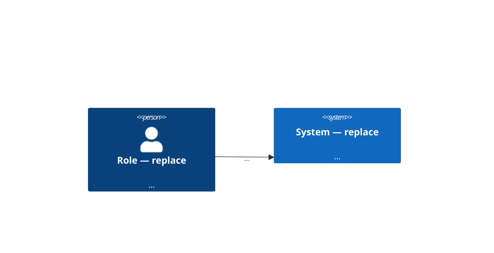
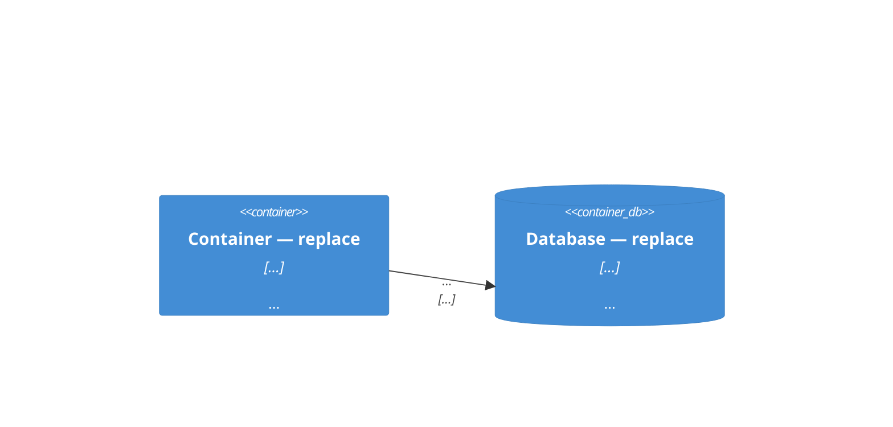

# BA Template & Skill Upgrade Implementation Plan

> **For agentic workers:** REQUIRED SUB-SKILL: Use superpowers:subagent-driven-development (recommended) or superpowers:executing-plans to implement this plan task-by-task. Steps use checkbox (`- [ ]`) syntax for tracking.

**Goal:** Upgrade the BA scaffold (ticket/mission templates, ba-ticket-author and ba-mission-plan skills) and add warning-level lint checks so tickets are Dev-ready by construction: verifiable ACs, owned unknowns, NFR/UI/sequencing sections.

**Architecture:** All changes land at the scaffold source `src/center_kb/templates/init/` plus the lint engine (`ticketlint.py`, `missionlint.py`, shared `lintcore.py`, new `acquality.py`). New lint checks are **warnings only** — `REQUIRED_HEADINGS` / `REQUIRED_MISSION_HEADINGS` are compatibility contracts and are NOT touched; legacy documents keep `DoR: PASS`.

**Tech Stack:** Python 3.13, pytest, existing center-kb lint framework (`Issue`, `LintReport`, `section_body`).

**Spec:** `docs/superpowers/specs/2026-08-12-ba-template-skill-upgrade-design.md`

## Global Constraints

- NEVER add entries to `ticket.REQUIRED_HEADINGS` or `mission.REQUIRED_MISSION_HEADINGS` — breaking-change contracts (module docstrings say so).
- NEVER change the `## US backlog` header row `| US ID | Title |` — lint matches it verbatim.
- All new lint issues use level `"warning"`, never `"error"`.
- New mission section name is `## Technology decisions` (spec "Decisions made" table).
- New template guidance text is English. The banned-phrase *detection* list is bilingual VI+EN.
- Test command: `.venv/bin/pytest` from repo root (`/Users/vuonglq01685/Documents/Projects/AERO-KB`). Repo venv is `.venv` (python3.13).
- Branch: `feat/ba-template-skill-upgrade-v2` (already created, spec committed).
- Existing tests that assert `report.issues == []` on golden fixtures MUST keep passing — goldens get the new sections filled cleanly (Tasks 3–4).
- Commit after every task; conventional commit messages; no attribution footer.

---

### Task 1: `acquality.py` — banned weasel-phrase detection

**Files:**
- Create: `src/center_kb/acquality.py`
- Test: `tests/test_acquality.py`

**Interfaces:**
- Produces: `acquality.OPEN_RE: re.Pattern[str]` (matches `OPEN(<owner>)` markers), `acquality.WEASEL_PHRASES: tuple[str, ...]`, `acquality.weasel_hits(line: str) -> list[str]` (banned phrases found in `line`; empty when the line carries an `OPEN(...)` suppressor). Used by Task 3 (`ticketlint`).

- [ ] **Step 1: Write the failing test**

Create `tests/test_acquality.py`:

```python
"""Tests for the banned weasel-phrase detector shared by the DoR lints."""

from __future__ import annotations

from center_kb import acquality


def test_open_re_matches_owned_marker():
    assert acquality.OPEN_RE.search("Target is OPEN(design-team)")
    assert not acquality.OPEN_RE.search("no marker here")
    # An empty owner is not an owned unknown.
    assert not acquality.OPEN_RE.search("OPEN()")


def test_weasel_hits_finds_english_phrases():
    hits = acquality.weasel_hits(
        "AC1: retention is configured and response is appropriate"
    )
    assert "configured" in hits
    assert "appropriate" in hits


def test_weasel_hits_finds_vietnamese_phrases():
    assert acquality.weasel_hits("Giá trị đã cấu hình cho hệ thống") == [
        "đã cấu hình"
    ]
    assert acquality.weasel_hits("Hiển thị một tập con các trường") == [
        "một tập con"
    ]


def test_weasel_hits_is_case_insensitive():
    assert acquality.weasel_hits("Show a SUBSET of fields") == ["SUBSET"] or (
        acquality.weasel_hits("Show A Subset of fields") == ["A Subset"]
    )


def test_open_marker_suppresses_the_line():
    line = "Retention is configured OPEN(data-team)"
    assert acquality.weasel_hits(line) == []


def test_clean_line_has_no_hits():
    assert (
        acquality.weasel_hits(
            "AC1: Show airspace type and level per arinc-424 §5.3"
        )
        == []
    )


def test_word_boundaries_avoid_substring_false_positives():
    # 'configured' must not fire inside 'preconfigured-widget-name'.
    assert acquality.weasel_hits("uses preconfigured defaults") == []
```

- [ ] **Step 2: Run test to verify it fails**

Run: `.venv/bin/pytest tests/test_acquality.py -v`
Expected: FAIL / ERROR with `ModuleNotFoundError: No module named 'center_kb.acquality'` (collection error is the expected red state).

- [ ] **Step 3: Write the implementation**

Create `src/center_kb/acquality.py`:

```python
"""AC quality — banned weasel-phrase detection for the DoR lints.

The phrase list mirrors ``docs/ac-quality.md`` scaffolded into BA repos
(source: ``templates/init/ac-quality.md``). Detection is bilingual
(EN + VI) because ticket bodies follow the BA's working language.
Callers report hits as WARNINGS only — the BA judges; nothing here may
flip a DoR verdict.
"""

from __future__ import annotations

import re

# 'OPEN(<owner>)' — an explicitly owned unknown. Its presence anywhere on
# a line suppresses the weasel warning for that line: the vagueness is
# declared and owned, which is the documented exception.
OPEN_RE = re.compile(r"OPEN\([^)\s][^)]*\)")

# Bilingual banned phrases (kept in sync with templates/init/ac-quality.md).
WEASEL_PHRASES: tuple[str, ...] = (
    "configured",
    "đã cấu hình",
    "appropriate",
    "reasonable",
    "phù hợp",
    "hợp lý",
    "a subset",
    "subset",
    "some fields",
    "một tập con",
    "một số trường",
    "responsive",
    "phản hồi tốt",
    "không bị chậm",
    "handled correctly",
    "xử lý đúng",
    "where applicable",
    "if needed",
    "nếu cần",
    "full support for",
    "hỗ trợ đầy đủ",
    "phân biệt theo loại",
)

# Longest-first so 'a subset' wins over the bare 'subset' fallback and the
# reported phrase is the most specific one. \b guards keep 'configured'
# from firing inside 'preconfigured'. Python's \w is Unicode-aware, so the
# boundaries work for the Vietnamese phrases too.
_WEASEL_RE = re.compile(
    "|".join(
        rf"\b{re.escape(p)}\b"
        for p in sorted(WEASEL_PHRASES, key=len, reverse=True)
    ),
    re.IGNORECASE,
)


def weasel_hits(line: str) -> list[str]:
    """Banned phrases in ``line``; ``[]`` when an ``OPEN(...)`` suppressor
    is present. Returns the matched text verbatim (original casing)."""
    if OPEN_RE.search(line):
        return []
    return [m.group(0) for m in _WEASEL_RE.finditer(line)]
```

- [ ] **Step 4: Run test to verify it passes**

Run: `.venv/bin/pytest tests/test_acquality.py -v`
Expected: all PASS. Note the case-insensitivity test: "a SUBSET" matches the bare `subset` pattern (longest-first alternation picks `a subset` when the article is present); either assertion branch passing is fine.

- [ ] **Step 5: Commit**

```bash
git add src/center_kb/acquality.py tests/test_acquality.py
git commit -m "feat: bilingual weasel-phrase detector for AC quality lint"
```

---

### Task 2: `lintcore` shared helpers — open-question rows, owners, recommended sections, table rows

**Files:**
- Modify: `src/center_kb/lintcore.py` (append after `check_diagram`, around line 194)
- Test: `tests/test_lintcore.py` (append new tests)

**Interfaces:**
- Consumes: existing `lintcore.section_body`, `lintcore.FENCE_RE`, `Issue` from `center_kb.doctor`.
- Produces (used by Tasks 3–4):
  - `lintcore.HTML_COMMENT_RE: re.Pattern[str]`
  - `lintcore.open_question_rows(text: str) -> list[str] | None` — checkbox rows of `## Open questions`; `None` when the heading is absent.
  - `lintcore.check_open_question_owners(rows: list[str]) -> list[Issue]` — warning per row without `owner:`.
  - `lintcore.check_recommended_sections(text: str, headings: tuple[str, ...]) -> list[Issue]` — warning per missing or empty heading.
  - `lintcore.table_rows(body: str) -> list[list[str]]` — all `|`-rows as cell lists, separator rows dropped, header row INCLUDED as row 0.

- [ ] **Step 1: Write the failing tests**

Append to `tests/test_lintcore.py`:

```python
# --- new-template shared helpers (BA upgrade v2) ---

from center_kb.lintcore import (
    check_open_question_owners,
    check_recommended_sections,
    open_question_rows,
    table_rows,
)


def test_open_question_rows_none_when_heading_absent():
    assert open_question_rows("# T\n\n## Summary\nx\n") is None


def test_open_question_rows_extracts_checkbox_rows():
    text = (
        "# T\n\n## Open questions\n"
        "- [ ] Q1 — color token — owner: design — blocks: AC3\n"
        "- [x] Q2 — closed one — owner: ba\n"
        "not a row\n"
    )
    rows = open_question_rows(text)
    assert rows is not None and len(rows) == 2
    assert rows[0].startswith("Q1")


def test_check_open_question_owners_warns_per_ownerless_row():
    issues = check_open_question_owners(
        ["Q1 — who decides — owner: ba", "Q2 — nobody owns this"]
    )
    assert len(issues) == 1
    assert issues[0].level == "warning"
    assert "Q2" in issues[0].message


def test_check_recommended_sections_missing_and_empty():
    text = "# T\n\n## Dependencies\n\n## Out of scope\nEditing records.\n"
    issues = check_recommended_sections(
        text, ("## Dependencies", "## Out of scope", "## Open questions")
    )
    messages = [i.message for i in issues]
    assert all(i.level == "warning" for i in issues)
    assert any(
        "'## Dependencies' is empty" in m for m in messages
    )
    assert any(
        "recommended section missing: '## Open questions'" in m
        for m in messages
    )
    assert not any("Out of scope" in m for m in messages)


def test_check_recommended_sections_html_comment_only_body_is_empty():
    text = "# T\n\n## Dependencies\n<!-- guidance left in place -->\n"
    issues = check_recommended_sections(text, ("## Dependencies",))
    assert len(issues) == 1
    assert "empty" in issues[0].message


def test_check_recommended_sections_ignores_heading_inside_fence():
    text = "# T\n\n```\n## Dependencies\n```\n"
    issues = check_recommended_sections(text, ("## Dependencies",))
    assert len(issues) == 1
    assert "missing" in issues[0].message


def test_table_rows_parses_cells_and_drops_separators():
    body = (
        "| # | Decision | Status | Owner | Blocks |\n"
        "|---|---|---|---|---|\n"
        "| D1 | Storage engine | OPEN | tech-lead | M-x-US1 |\n"
    )
    rows = table_rows(body)
    assert rows[0][1] == "Decision"
    assert rows[1] == ["D1", "Storage engine", "OPEN", "tech-lead", "M-x-US1"]
    assert len(rows) == 2
```

- [ ] **Step 2: Run tests to verify they fail**

Run: `.venv/bin/pytest tests/test_lintcore.py -v -k "open_question or recommended or table_rows"`
Expected: FAIL with `ImportError: cannot import name 'check_open_question_owners'`.

- [ ] **Step 3: Write the implementation**

Append to `src/center_kb/lintcore.py` (after `check_diagram`, before `strip_bare_kb_context`):

```python
# An HTML comment — the templates carry guidance in '<!-- ... -->' blocks
# and BAs sometimes leave them in place; scanners that would false-fire on
# guidance text (which mentions 'OPEN(<owner>)' and the banned phrases as
# examples) strip these first.
HTML_COMMENT_RE = re.compile(r"<!--.*?-->", re.S)

# A '- [ ]' / '- [x]' checkbox list item (open-question rows).
CHECKBOX_ROW_RE = re.compile(r"^-\s*\[[ xX]\]\s*(.+)$")

OPEN_QUESTIONS_HEADING = "## Open questions"


def open_question_rows(text: str) -> list[str] | None:
    """Checkbox rows of '## Open questions'; None when the heading is
    absent (callers distinguish 'no section' from 'section with no rows')."""
    body = section_body(text, OPEN_QUESTIONS_HEADING)
    if body is None:
        return None
    return [
        m.group(1)
        for line in body.splitlines()
        if (m := CHECKBOX_ROW_RE.match(line.strip()))
    ]


def check_open_question_owners(rows: list[str]) -> list[Issue]:
    """Warning per open-question row without an 'owner:' tag — an unknown
    without an owner sits until a Dev trips over it (spec NT3)."""
    return [
        Issue(
            "warning",
            f"open question has no 'owner:': '{row.strip()}'",
        )
        for row in rows
        if "owner:" not in row
    ]


def check_recommended_sections(
    text: str, headings: tuple[str, ...]
) -> list[Issue]:
    """Warning per recommended heading that is missing or has an empty
    body. Warning-level on purpose: the required-heading sets are
    compatibility contracts and legacy documents must keep passing."""
    present = {line.strip() for line in FENCE_RE.sub("", text).splitlines()}
    issues: list[Issue] = []
    for heading in headings:
        if heading not in present:
            issues.append(
                Issue(
                    "warning",
                    f"recommended section missing: '{heading}' — add it, "
                    "or write 'N/A — <reason>'",
                )
            )
            continue
        body = section_body(text, heading)
        if body is not None and not HTML_COMMENT_RE.sub("", body).strip():
            issues.append(
                Issue(
                    "warning",
                    f"'{heading}' is empty — fill it or write "
                    "'N/A — <reason>'",
                )
            )
    return issues


def table_rows(body: str) -> list[list[str]]:
    """All '|'-delimited rows of `body` as stripped cell lists. Separator
    rows ('|---|---|') are dropped; the header row is INCLUDED as row 0 —
    callers slice `[1:]` for data rows."""
    _SEP = re.compile(r"^\|[\s:|-]+\|$")
    rows: list[list[str]] = []
    for line in body.splitlines():
        line = line.strip()
        if not line.startswith("|") or not line.endswith("|"):
            continue
        if _SEP.match(line):
            continue
        rows.append([c.strip() for c in line[1:-1].split("|")])
    return rows
```

- [ ] **Step 4: Run tests to verify they pass**

Run: `.venv/bin/pytest tests/test_lintcore.py -v`
Expected: all PASS (old and new).

- [ ] **Step 5: Commit**

```bash
git add src/center_kb/lintcore.py tests/test_lintcore.py
git commit -m "feat: lintcore helpers for open questions, recommended sections, tables"
```

---

### Task 3: ticket lint — weasel ACs, owned unknowns, recommended sections

**Files:**
- Modify: `src/center_kb/ticket.py` (append constant after `REQUIRED_HEADINGS`)
- Modify: `src/center_kb/ticketlint.py`
- Test: `tests/test_ticketlint.py`

**Interfaces:**
- Consumes: `acquality.weasel_hits`, `acquality.OPEN_RE` (Task 1); `lintcore.open_question_rows`, `check_open_question_owners`, `check_recommended_sections`, `HTML_COMMENT_RE` (Task 2); `mission.PLACEHOLDER` (existing, value `%%TODO: verify against codebase%%`).
- Produces: `ticket.RECOMMENDED_HEADINGS: tuple[str, ...]` (used by Task 5 template tests and Task 4 has its mission twin).

- [ ] **Step 1: Add `RECOMMENDED_HEADINGS` to `src/center_kb/ticket.py`**

Insert directly after the `REQUIRED_HEADINGS` tuple (after its closing paren, line 27):

```python
# New-template sections (BA upgrade v2). Deliberately NOT merged into
# REQUIRED_HEADINGS: that tuple is a compatibility contract and every
# pre-existing ticket must keep passing without an edit. Lint reports a
# missing/empty recommended section as a WARNING only. Order matches the
# template (all inserted before '## KB context').
RECOMMENDED_HEADINGS: tuple[str, ...] = (
    "## Dependencies",
    "## Non-functional requirements",
    "## UI / presentation spec",
    "## Out of scope",
    "## Test data & verification",
    "## Open questions",
)
```

- [ ] **Step 2: Extend the golden-ticket builder in `tests/test_ticketlint.py`**

The builder currently iterates `ticket.REQUIRED_HEADINGS`, so new sections would never appear. Make these three edits:

2a. Add the clean new-section bodies to `_default_sections` (insert the new keys after the `"## Business flow"` entry, before `"## KB context"`):

```python
        "## Dependencies": "- Blocked by: None\n- Blocks: None",
        "## Non-functional requirements": (
            "| Concern | Target | How to measure | Source |\n"
            "|---|---|---|---|\n"
            "| Detail render | Details visible within 2 s of polygon "
            "click | Stopwatch check on staging | team SLA |"
        ),
        "## UI / presentation spec": (
            "Side panel lists designation, type, and level as labeled "
            "rows; empty state shows 'No restrictive airspace nearby'."
        ),
        "## Out of scope": "Editing airspace records.",
        "## Test data & verification": (
            "Sample record with designation R-2905A: expect type 'R' and "
            "level 'L1' shown in the panel."
        ),
        "## Open questions": (
            "- [ ] Q1 — Confirm the polygon fill color token — "
            "owner: design-team — blocks: UI spec"
        ),
```

2b. Add a module-level ordered heading tuple right after the `REFS` constant:

```python
# Template order: required + recommended sections, recommended ones
# inserted before '## KB context' exactly as in ticket-template.md.
ALL_HEADINGS = (
    "## Summary",
    "## User Story",
    "## Background / Business context",
    "## Acceptance Criteria",
    "## Use cases",
    "## Sequence diagram",
    "## Business flow",
    "## Dependencies",
    "## Non-functional requirements",
    "## UI / presentation spec",
    "## Out of scope",
    "## Test data & verification",
    "## Open questions",
    "## KB context",
    "## Definition of Ready",
)
```

2c. In `_build_ticket`, change the loop source from `ticket.REQUIRED_HEADINGS` to `ALL_HEADINGS`:

```python
    for heading in ALL_HEADINGS:
```

- [ ] **Step 3: Write the failing lint tests**

Append to `tests/test_ticketlint.py`:

```python
# --- new-template warnings (BA upgrade v2) ---


def test_golden_ticket_still_passes_with_no_issues(
    fed_hub: Path, golden_block: str
):
    report = ticketlint.lint(_build_ticket(golden_block), _hub(fed_hub))
    assert report.passed is True
    assert report.issues == []


def test_weasel_ac_without_open_marker_warns(
    fed_hub: Path, golden_block: str
):
    doc = _build_ticket(
        golden_block,
        overrides={
            "## Acceptance Criteria": (
                "- [ ] AC1: Retention is configured per "
                "arinc-kb:arinc-424 §5.3\n"
                "- [ ] AC2: Show ICAO designation per "
                "icao-kb:icao-annex-2 §1.1"
            )
        },
    )
    report = ticketlint.lint(doc, _hub(fed_hub))
    assert report.passed is True  # warning, never an error
    assert any(
        "banned weasel phrase 'configured'" in w for w in _warnings(report)
    )


def test_weasel_ac_with_open_marker_is_suppressed(
    fed_hub: Path, golden_block: str
):
    doc = _build_ticket(
        golden_block,
        overrides={
            "## Acceptance Criteria": (
                "- [ ] AC1: Retention is configured OPEN(data-team) per "
                "arinc-kb:arinc-424 §5.3\n"
                "- [ ] AC2: Show ICAO designation per "
                "icao-kb:icao-annex-2 §1.1"
            )
        },
    )
    report = ticketlint.lint(doc, _hub(fed_hub))
    assert not any("weasel" in w for w in _warnings(report))


def test_orphan_open_marker_warns_when_open_questions_has_no_rows(
    fed_hub: Path, golden_block: str
):
    doc = _build_ticket(
        golden_block,
        overrides={
            "## UI / presentation spec": "OPEN(design-team)",
            "## Open questions": "None yet.",
        },
    )
    report = ticketlint.lint(doc, _hub(fed_hub))
    assert report.passed is True
    assert any(
        "every unknown needs an owned row" in w for w in _warnings(report)
    )


def test_open_marker_with_matching_row_is_clean(
    fed_hub: Path, golden_block: str
):
    doc = _build_ticket(
        golden_block,
        overrides={
            "## UI / presentation spec": "OPEN(design-team)",
            "## Open questions": (
                "- [ ] Q1 — UI spec needs design input — "
                "owner: design-team — blocks: UI / presentation spec"
            ),
        },
    )
    report = ticketlint.lint(doc, _hub(fed_hub))
    assert not any("owned row" in w for w in _warnings(report))


def test_ownerless_open_question_row_warns(
    fed_hub: Path, golden_block: str
):
    doc = _build_ticket(
        golden_block,
        overrides={
            "## Open questions": "- [ ] Q1 — nobody owns this question"
        },
    )
    report = ticketlint.lint(doc, _hub(fed_hub))
    assert any("no 'owner:'" in w for w in _warnings(report))


def test_missing_recommended_section_warns_but_passes(
    fed_hub: Path, golden_block: str
):
    doc = _build_ticket(golden_block, skip="## Dependencies")
    report = ticketlint.lint(doc, _hub(fed_hub))
    assert report.passed is True
    assert any(
        "recommended section missing: '## Dependencies'" in w
        for w in _warnings(report)
    )


def test_legacy_nine_section_ticket_still_passes(
    fed_hub: Path, golden_block: str
):
    """A pre-upgrade ticket (only the 9 required sections) keeps DoR: PASS
    — the new checks are warnings, REQUIRED_HEADINGS is untouched."""
    sections = _default_sections(golden_block)
    parts = [DEFAULT_TITLE, ""]
    for heading in ticket.REQUIRED_HEADINGS:
        parts.append(heading)
        parts.append(sections[heading])
        parts.append("")
    report = ticketlint.lint("\n".join(parts), _hub(fed_hub))
    assert report.passed is True
    assert len(_warnings(report)) == len(ticket.RECOMMENDED_HEADINGS)


def test_recommended_headings_constant_is_not_in_required():
    assert set(ticket.RECOMMENDED_HEADINGS).isdisjoint(
        set(ticket.REQUIRED_HEADINGS)
    )
```

- [ ] **Step 4: Run tests to verify the new ones fail**

Run: `.venv/bin/pytest tests/test_ticketlint.py -v`
Expected: the new tests FAIL (no weasel/orphan/recommended warnings are emitted yet); `test_golden_ticket_passes` and other pre-existing tests still PASS (builder change only adds clean sections that no current check inspects). `test_legacy_nine_section_ticket_still_passes` fails on the warning count (0 != 6).

- [ ] **Step 5: Implement the checks in `src/center_kb/ticketlint.py`**

5a. Extend the import line:

```python
from center_kb import acquality, lintcore, mission, missionlint, ticket
```

5b. Add three functions after `_check_ac_citations`:

```python
def _check_ac_weasel(ac_items: list[str]) -> list[Issue]:
    """NT2 — an AC that cannot be acceptance-tested does not exist.
    Warning per banned phrase (docs/ac-quality.md); an OPEN(<owner>)
    marker on the same AC suppresses it (declared, owned vagueness)."""
    return [
        Issue(
            "warning",
            f"AC uses banned weasel phrase '{phrase}' without "
            f"OPEN(<owner>): '{item.strip()}' — see docs/ac-quality.md",
        )
        for item in ac_items
        for phrase in acquality.weasel_hits(item)
    ]


def _unknown_count(text: str) -> int:
    """OPEN(...) + %%TODO%% markers, guidance comments stripped so the
    templates' own '<!-- ... OPEN(<owner>) ... -->' examples never count."""
    clean = lintcore.HTML_COMMENT_RE.sub("", text)
    return len(acquality.OPEN_RE.findall(clean)) + clean.count(
        mission.PLACEHOLDER
    )


def _check_owned_unknowns(text: str) -> list[Issue]:
    """NT3 — 'unknown' is valid; 'unknown without an owner' is not. Every
    OPEN(...)/%%TODO%% outside '## Open questions' needs an owned row
    there. Count-based: exact marker-to-row matching is not decidable, so
    the check demands at least as many rows as markers."""
    rows = lintcore.open_question_rows(text) or []
    oq_body = lintcore.section_body(
        text, lintcore.OPEN_QUESTIONS_HEADING
    )
    outside = _unknown_count(text) - _unknown_count(oq_body or "")
    issues: list[Issue] = []
    if outside > len(rows):
        issues.append(
            Issue(
                "warning",
                f"{outside} OPEN(...)/'{mission.PLACEHOLDER}' marker(s) "
                f"but only {len(rows)} row(s) in '## Open questions' — "
                "every unknown needs an owned row",
            )
        )
    issues += lintcore.check_open_question_owners(rows)
    return issues
```

5c. Wire them into `lint()` — insert after the `issues += _check_ac_citations(ac_items)` line:

```python
    issues += _check_ac_weasel(ac_items)
    issues += lintcore.check_recommended_sections(
        text, ticket.RECOMMENDED_HEADINGS
    )
    issues += _check_owned_unknowns(text)
```

- [ ] **Step 6: Run tests to verify they pass**

Run: `.venv/bin/pytest tests/test_ticketlint.py tests/test_mission_ticket_traceability.py tests/test_cli_ticket.py -v`
Expected: all PASS. If a pre-existing test fails because its hand-built ticket now emits extra *warnings* into an exact-equality assertion, fix the TEST by building via `_build_ticket` (clean sections) — never by weakening the check. Errors must be unchanged everywhere.

- [ ] **Step 7: Commit**

```bash
git add src/center_kb/ticket.py src/center_kb/ticketlint.py tests/test_ticketlint.py
git commit -m "feat: ticket lint warnings — weasel ACs, owned unknowns, recommended sections"
```

---

### Task 4: mission lint — technology decisions, sequencing coverage, open-question owners

**Files:**
- Modify: `src/center_kb/mission.py` (append constants after `PLACEHOLDER`, line 65)
- Modify: `src/center_kb/missionlint.py`
- Test: `tests/test_missionlint.py`

**Interfaces:**
- Consumes: `lintcore.table_rows`, `check_recommended_sections`, `open_question_rows`, `check_open_question_owners` (Task 2); existing `mission.PLACEHOLDER`, `mission.COMPONENT_HEADING`, `check_backlog`.
- Produces: `mission.RECOMMENDED_MISSION_HEADINGS`, `mission.TECH_DECISIONS_HEADING`, `mission.SEQUENCING_HEADING`; `missionlint.check_technology_decisions(text) -> list[Issue]`, `missionlint.check_sequencing(text, us_ids) -> list[Issue]`.

- [ ] **Step 1: Add constants to `src/center_kb/mission.py`** (after the `PLACEHOLDER` assignment):

```python
# New-template sections (BA upgrade v2). NOT merged into
# REQUIRED_MISSION_HEADINGS — that tuple is a compatibility contract;
# lint reports these as WARNINGS only.
TECH_DECISIONS_HEADING = "## Technology decisions"
SEQUENCING_HEADING = "## Sequencing"
RECOMMENDED_MISSION_HEADINGS: tuple[str, ...] = (
    TECH_DECISIONS_HEADING,
    "## Non-functional requirements",
    SEQUENCING_HEADING,
    "## Open questions",
)
```

- [ ] **Step 2: Extend the golden-mission builder in `tests/test_missionlint.py`**

2a. Add the clean new-section bodies to `_default_sections` (insert after the `"## US backlog"` entry):

```python
        "## Technology decisions": (
            "| # | Decision | Status | Owner | Blocks |\n"
            "|---|---|---|---|---|\n"
            "| D1 | Map rendering library | DECIDED | tech-lead | "
            f"{MISSION_ID}-US1 |"
        ),
        "## Non-functional requirements": (
            "| Concern | Target | How to measure | Source |\n"
            "|---|---|---|---|\n"
            "| Map load | First render under 3 s with 500 polygons | "
            "Grafana p95 dashboard | team SLA |"
        ),
        "## Sequencing": (
            "| US ID | Depends on | Size | Notes |\n"
            "|---|---|---|---|\n"
            f"| {MISSION_ID}-US1 | None | M | Foundation |\n"
            f"| {MISSION_ID}-US2 | {MISSION_ID}-US1 | S | |"
        ),
        "## Open questions": (
            "- [ ] Q1 — Confirm map tile provider quota — "
            "owner: tech-lead — impact: cost — blocks: "
            f"{MISSION_ID}-US1"
        ),
```

2b. Add an ordered tuple after the `REFS` constant:

```python
# Template order: required + recommended sections as in mission-template.md
# ('## Technology decisions' and NFR after C4 L2; Sequencing and Open
# questions after the backlog).
ALL_MISSION_HEADINGS = (
    "## Summary",
    "## Business goal",
    "## Scope",
    "## System context (C4 L1)",
    "## Containers (C4 L2)",
    "## Technology decisions",
    "## Non-functional requirements",
    "## Constraints & assumptions",
    "## US backlog",
    "## Sequencing",
    "## Open questions",
    "## KB context",
    "## Definition of Ready",
)
```

2c. In `_build_mission`, change the loop source from `mission.REQUIRED_MISSION_HEADINGS` to `ALL_MISSION_HEADINGS`.

- [ ] **Step 3: Write the failing tests**

Append to `tests/test_missionlint.py`:

```python
# --- new-template warnings (BA upgrade v2) ---


def test_golden_mission_emits_no_new_warnings(
    fed_hub: Path, golden_block: str, tmp_path: Path
):
    report = missionlint.lint(
        _build_mission(golden_block), _hub(fed_hub)
    )
    assert report.passed is True
    assert _warnings(report) == []


def test_c4_todo_without_decision_row_warns(
    fed_hub: Path, golden_block: str
):
    l2 = (
        "```mermaid\n"
        "C4Container\n"
        "  Container(api, \"Airspace API — "
        "%%TODO: verify against codebase%%\", \"Python\")\n"
        "```"
    )
    doc = _build_mission(
        golden_block,
        overrides={
            "## Containers (C4 L2)": l2,
            "## Technology decisions": (
                "| # | Decision | Status | Owner | Blocks |\n"
                "|---|---|---|---|---|"
            ),
        },
    )
    report = missionlint.lint(doc, _hub(fed_hub))
    assert report.passed is True
    assert any(
        "every placeholder needs an owned decision row" in w
        for w in _warnings(report)
    )


def test_c4_todo_with_owned_decision_row_is_clean(
    fed_hub: Path, golden_block: str
):
    l2 = (
        "```mermaid\n"
        "C4Container\n"
        "  Container(api, \"Airspace API — "
        "%%TODO: verify against codebase%%\", \"Python\")\n"
        "```"
    )
    doc = _build_mission(
        golden_block,
        overrides={
            "## Containers (C4 L2)": l2,
            "## Technology decisions": (
                "| # | Decision | Status | Owner | Blocks |\n"
                "|---|---|---|---|---|\n"
                "| D1 | Airspace API stack | OPEN | tech-lead | "
                f"{MISSION_ID}-US1 |"
            ),
        },
    )
    report = missionlint.lint(doc, _hub(fed_hub))
    assert not any(
        "decision row" in w for w in _warnings(report)
    )
    # The pre-existing placeholder-count warning still fires — additive.
    assert any("unresolved" in w for w in _warnings(report))


def test_ownerless_decision_row_warns(fed_hub: Path, golden_block: str):
    doc = _build_mission(
        golden_block,
        overrides={
            "## Technology decisions": (
                "| # | Decision | Status | Owner | Blocks |\n"
                "|---|---|---|---|---|\n"
                f"| D1 | Storage engine | OPEN | <who> | {MISSION_ID}-US1 |"
            ),
        },
    )
    report = missionlint.lint(doc, _hub(fed_hub))
    assert any(
        "has no owner" in w for w in _warnings(report)
    )


def test_sequencing_not_covering_backlog_warns(
    fed_hub: Path, golden_block: str
):
    doc = _build_mission(
        golden_block,
        overrides={
            "## Sequencing": (
                "| US ID | Depends on | Size | Notes |\n"
                "|---|---|---|---|\n"
                f"| {MISSION_ID}-US1 | None | M | |"
            ),
        },
    )
    report = missionlint.lint(doc, _hub(fed_hub))
    assert report.passed is True
    assert any(
        f"'## Sequencing' does not cover: {MISSION_ID}-US2" in w
        for w in _warnings(report)
    )


def test_missing_recommended_mission_section_warns(
    fed_hub: Path, golden_block: str
):
    doc = _build_mission(golden_block, skip="## Sequencing")
    report = missionlint.lint(doc, _hub(fed_hub))
    assert report.passed is True
    assert any(
        "recommended section missing: '## Sequencing'" in w
        for w in _warnings(report)
    )


def test_ownerless_mission_open_question_warns(
    fed_hub: Path, golden_block: str
):
    doc = _build_mission(
        golden_block,
        overrides={"## Open questions": "- [ ] Q1 — unowned question"},
    )
    report = missionlint.lint(doc, _hub(fed_hub))
    assert any("no 'owner:'" in w for w in _warnings(report))


def test_legacy_mission_still_passes(fed_hub: Path, golden_block: str):
    """A pre-upgrade mission (only required sections) keeps DoR: PASS."""
    sections = _default_sections(golden_block)
    parts = [DEFAULT_TITLE, "", MISSION_LINE, ""]
    for heading in mission.REQUIRED_MISSION_HEADINGS:
        parts.append(heading)
        parts.append(sections[heading])
        parts.append("")
    report = missionlint.lint("\n".join(parts), _hub(fed_hub))
    assert report.passed is True
```

- [ ] **Step 4: Run tests to verify the new ones fail**

Run: `.venv/bin/pytest tests/test_missionlint.py -v`
Expected: new tests FAIL (warnings not emitted); pre-existing tests PASS. Any pre-existing test that asserted an exact warning list and now sees extra warnings from a hand-built doc: rebuild that doc via `_build_mission` (clean sections). Errors unchanged everywhere.

- [ ] **Step 5: Implement in `src/center_kb/missionlint.py`**

5a. Add two functions after `check_placeholders`:

```python
def check_technology_decisions(text: str) -> list[Issue]:
    """New-template check (warning). Every C4 '%%TODO%%' placeholder
    needs an owned row in '## Technology decisions' — a placeholder
    without an owner sits until a Dev trips over it (spec NT3). Exact
    placeholder-to-row matching is not decidable, so the check is
    count-based: at least as many data rows as C4 placeholders."""
    todo_count = 0
    for heading in (
        "## System context (C4 L1)",
        "## Containers (C4 L2)",
        mission.COMPONENT_HEADING,
    ):
        body = lintcore.section_body(text, heading)
        if body:
            todo_count += body.count(mission.PLACEHOLDER)

    body = lintcore.section_body(text, mission.TECH_DECISIONS_HEADING)
    rows = lintcore.table_rows(body)[1:] if body is not None else []

    issues: list[Issue] = []
    if todo_count > len(rows):
        issues.append(
            Issue(
                "warning",
                f"{todo_count} C4 '{mission.PLACEHOLDER}' placeholder(s) "
                f"but only {len(rows)} '{mission.TECH_DECISIONS_HEADING}' "
                "row(s) — every placeholder needs an owned decision row",
            )
        )
    for cells in rows:
        owner = cells[3] if len(cells) > 3 else ""
        if not owner or owner.startswith("<"):
            label = cells[1] if len(cells) > 1 else cells[0]
            issues.append(
                Issue(
                    "warning",
                    f"Technology decision '{label}' has no owner",
                )
            )
    return issues


def check_sequencing(text: str, us_ids: list[str]) -> list[Issue]:
    """New-template check (warning). '## Sequencing' must cover every
    backlog US id — Devs never infer ordering. A missing section is
    already reported by the recommended-sections check; this one only
    fires on partial coverage."""
    body = lintcore.section_body(text, mission.SEQUENCING_HEADING)
    if body is None:
        return []
    covered = {
        cells[0] for cells in lintcore.table_rows(body)[1:] if cells[0]
    }
    missing = [u for u in us_ids if u not in covered]
    if not missing:
        return []
    return [
        Issue(
            "warning",
            "'## Sequencing' does not cover: " + ", ".join(missing),
        )
    ]
```

5b. Wire into `lint()` — insert directly before the `issues += check_placeholders(text)` line:

```python
    issues += lintcore.check_recommended_sections(
        text, mission.RECOMMENDED_MISSION_HEADINGS
    )
    issues += check_technology_decisions(text)
    if not backlog_issues:
        issues += check_sequencing(text, us_ids)
    issues += lintcore.check_open_question_owners(
        lintcore.open_question_rows(text) or []
    )
```

- [ ] **Step 6: Run tests to verify they pass**

Run: `.venv/bin/pytest tests/test_missionlint.py tests/test_cli_mission.py tests/test_mission_ticket_traceability.py -v`
Expected: all PASS.

- [ ] **Step 7: Commit**

```bash
git add src/center_kb/mission.py src/center_kb/missionlint.py tests/test_missionlint.py
git commit -m "feat: mission lint warnings — tech decisions, sequencing coverage, question owners"
```

---

### Task 5: templates — new ticket/mission templates + scaffolded `docs/ac-quality.md`

**Files:**
- Modify: `src/center_kb/templates/init/ticket-template.md` (full rewrite below)
- Modify: `src/center_kb/templates/init/mission-template.md` (full rewrite below)
- Create: `src/center_kb/templates/init/ac-quality.md`
- Modify: `src/center_kb/initcmd.py` (one `BA_TEMPLATES` entry)
- Test: `tests/test_templates.py`, `tests/test_ticketlint.py` (template-sync test), `tests/test_missionlint.py` (template-sync test)

**Interfaces:**
- Consumes: `ticket.RECOMMENDED_HEADINGS` (Task 3), `mission.RECOMMENDED_MISSION_HEADINGS` (Task 4).
- Produces: scaffolded file `docs/ac-quality.md` in every `kb init --kind ba` repo; templates whose headings match the lint contract + recommended sets.

- [ ] **Step 1: Write the failing template-sync tests**

1a. Append to `tests/test_ticketlint.py` (next to `test_template_headings_match_contract`):

```python
def test_template_carries_every_recommended_heading():
    template_path = (
        Path(__file__).resolve().parents[1]
        / "src"
        / "center_kb"
        / "templates"
        / "init"
        / "ticket-template.md"
    )
    content = template_path.read_text(encoding="utf-8")
    for heading in ticket.RECOMMENDED_HEADINGS:
        assert content.count(heading) == 1, heading
    assert "docs/ac-quality.md" in content
```

1b. Append to `tests/test_missionlint.py` (next to `test_shipped_template_contains_every_required_heading`):

```python
def test_shipped_template_contains_every_recommended_heading():
    text = _template_text()
    present = {line.strip() for line in text.splitlines()}
    for heading in mission.RECOMMENDED_MISSION_HEADINGS:
        assert heading in present, heading
```

1c. Append to `tests/test_templates.py`:

```python
def test_ac_quality_doc_exists_and_is_wired_into_ba_kind():
    from center_kb.initcmd import BA_TEMPLATES

    base = resources.files("center_kb").joinpath("templates/init")
    assert base.joinpath("ac-quality.md").is_file()
    assert BA_TEMPLATES["docs/ac-quality.md"] == "ac-quality.md"


def test_ac_quality_doc_carries_the_banned_phrases():
    text = _read_init_template("ac-quality.md")
    for marker in (
        "configured",
        "đã cấu hình",
        "a subset",
        "responsive",
        "OPEN(<owner>)",
        "## Open questions",
    ):
        assert marker in text, marker
```

(`resources` is already imported at the top of `test_templates.py`.)

- [ ] **Step 2: Run tests to verify they fail**

Run: `.venv/bin/pytest tests/test_templates.py tests/test_ticketlint.py::test_template_carries_every_recommended_heading "tests/test_missionlint.py::test_shipped_template_contains_every_recommended_heading" -v`
Expected: FAIL (new sections, file, and mapping entry absent).

- [ ] **Step 3: Rewrite `src/center_kb/templates/init/ticket-template.md`** with exactly this content:

````markdown
# <Title — one line, imperative, with identifier>

## Summary
<1–2 lines business summary>

## User Story
As a <role>, I want <capability>, so that <value>.

## Background / Business context
<context; every industry-standard claim cites `doc-id §section`>

## Acceptance Criteria
<!-- One observable outcome per AC, with concrete values. No weasel
words ("appropriate", "configured", "a subset", "responsive", … — the
full banned list is docs/ac-quality.md). An unsettled value is written
`OPEN(<owner>)` inside the AC AND gets a row in the Open questions
section below — never left vague. -->
- [ ] AC1 … (cite `doc-id §section` when it touches a standard)
- [ ] AC2 …

## Use cases
### Main flow
### Alternate / exception flows

## Sequence diagram
```mermaid
sequenceDiagram
  …
```

## Business flow
```mermaid
flowchart TD
  …
```

## Dependencies
<!-- Write "None" when there are none — a blank section reads as
"not considered". -->
- Blocked by: <us-id or external item> — <why>
- Blocks: <us-id>

## Non-functional requirements
<!-- Every row needs a number or a threshold, or `OPEN(<owner>)`.
Never "fast", "stable", "handles load". A pure data/backoffice ticket
with no NFR writes "N/A — <reason>". -->
| Concern | Target | How to measure | Source |
|---|---|---|---|

## UI / presentation spec
<!-- What the user sees: layout, labels, empty state, error state,
visual-distinction rules between types (say BY WHAT MEANS — label,
color, shape, grouping), display order, or a mockup link.
No design input yet → `OPEN(<owner>)`. No UI in this ticket → "N/A".
Never stop at "distinguished by type" without naming the means. -->

## Out of scope
<!-- This ticket's own boundary — distinct from the mission's
out-of-scope. List the things easily mistaken as belonging here. -->

## Test data & verification
<!-- Sample records + expected values. Tolerances for numeric checks.
How to verify each hard-to-test AC. No sample data yet →
`OPEN(<owner>)`. -->

## Open questions
<!-- Every `OPEN(...)` and every `%%TODO%%` in this ticket must have a
row here, with an owner. -->
- [ ] Q1 — <question> — owner: <who> — blocks: <AC# or section>

## KB context
```yaml
kb-context:
  version: "<hub commit>"
  refs:
    - <repo:doc-id §section>
  tags: [ … ]
```

## Definition of Ready
- [ ] Story, ACs, use cases, both diagrams present
- [ ] Every citation resolves at the pinned version (kb ticket lint PASS)
- [ ] No stale refs
- [ ] Every AC is acceptance-testable; no weasel words remain (docs/ac-quality.md)
- [ ] Dependencies, NFR, UI spec, Out of scope, Test data filled or "N/A — <reason>"
- [ ] Every open question has an owner
````

- [ ] **Step 4: Rewrite `src/center_kb/templates/init/mission-template.md`** with exactly this content:

````markdown
# <Mission title — one line, imperative>

<!-- Mission id format: lowercase letters/digits, hyphen-separated, e.g. M-checkout-v2 -->
> Mission: M-<slug>

## Summary
<1–2 lines: what this feature is, at epic level>

## Business goal
<why this exists and how success is measured; every industry-standard
claim cites `doc-id §section`>

## Scope
**In scope:** <what this mission covers>

**Out of scope:** <what it deliberately does not>

## System context (C4 L1)


## Containers (C4 L2)


<!-- Optional: if you have real component detail, add a "## Components (C4 L3)" section with a C4Component mermaid fence. Never invent components. -->

## Technology decisions
<!-- Every `%%TODO: verify against codebase%%` in the C4 sections has
exactly one row here. A placeholder without an owner means the mission
is not ready, even when lint passes. Status is OPEN or DECIDED. -->
| # | Decision | Status | Owner | Blocks |
|---|---|---|---|---|
| D1 | <e.g. storage engine choice> | OPEN | <who> | <US id> |

## Non-functional requirements
<!-- At least one quantified NFR is mandatory when the mission touches
large data volumes, concurrency, or real-time constraints.
Unsettled → `OPEN(<owner>)`, never blank. -->
| Concern | Target | How to measure | Source |
|---|---|---|---|

## Constraints & assumptions
<constraints and any detail that would need code knowledge — mark those
`%%TODO: verify against codebase%%`, never invent them. Questions that
need an answer go to `## Open questions`, not here.>

## US backlog
| US ID | Title |
|---|---|
| M-<slug>-US1 | <story title> |
| M-<slug>-US2 | <story title> |

## Sequencing
<!-- Separate section on purpose: the `## US backlog` header row
'| US ID | Title |' is matched verbatim by lint — never add columns. -->
| US ID | Depends on | Size | Notes |
|---|---|---|---|

## Open questions
<!-- Architecture-changing questions are flagged here and must be
closed BEFORE foundational stories start. -->
- [ ] Q1 — <question> — owner: <who> — impact: <architecture / scope / cost> — blocks: <US id>

## KB context
```yaml
kb-context:
  version: "<hub commit>"
  refs:
    - <repo:doc-id §section>
  tags: [ … ]
```

## Definition of Ready
- [ ] Business goal, scope, L1 + L2 diagrams, backlog present
- [ ] Every citation resolves at the pinned version (kb mission lint PASS)
- [ ] Backlog reviewed with the team; no known missing slice
- [ ] Every `%%TODO%%` has an owned row in Technology decisions
- [ ] Sequencing covers the whole backlog
- [ ] Architecture-impacting open questions closed
````

- [ ] **Step 5: Create `src/center_kb/templates/init/ac-quality.md`** with exactly this content:

```markdown
# AC quality — banned weasel words

An Acceptance Criterion must be verifiable by someone who has NOT read
the source documents. The phrases below shift all risk to Dev and QA,
then explode at acceptance time. They are banned in ACs; `kb ticket
lint` detects both the English and Vietnamese forms and reports each
hit as a warning.

| Banned phrase | Write instead |
|---|---|
| "configured", "đã cấu hình" | the real value, or `OPEN(<owner>)` + an Open questions row |
| "appropriate", "reasonable", "phù hợp", "hợp lý" | the concrete criterion |
| "a subset", "some fields", "một tập con", "một số trường" | the full explicit list |
| "responsive", "phản hồi tốt", "không bị chậm" | a number + how it is measured |
| "handled correctly", "xử lý đúng" | the observable behavior |
| "where applicable", "if needed", "nếu cần" | the concrete trigger condition |
| "full support for", "hỗ trợ đầy đủ" | the supported scope AND the unsupported scope |
| "distinguished by type" without the means, "phân biệt theo loại" | the means: label, color, shape, grouping |

**Exception:** a banned phrase is allowed only when the same line
carries `OPEN(<owner>)` AND the ticket has a matching row in
`## Open questions`.

Lint reports violations as warnings — the BA judges. The Definition of
Ready still requires them resolved before handover to Dev.
```

- [ ] **Step 6: Wire the new doc into `src/center_kb/initcmd.py`**

In the `BA_TEMPLATES` dict, insert after the `"docs/missions/TEMPLATE.md"` entry:

```python
    "docs/ac-quality.md": "ac-quality.md",
```

- [ ] **Step 7: Run tests to verify they pass**

Run: `.venv/bin/pytest tests/test_templates.py tests/test_init.py tests/test_scaffold.py tests/test_ticketlint.py tests/test_missionlint.py -v`
Expected: all PASS. `test_init_kind_ba_scaffolds_minimal_set` compares against `expected_files("ba")`, which derives from `BA_TEMPLATES` — it picks the new entry up automatically. `test_template_headings_match_contract` still holds (each required heading appears exactly once — the new DoR lines deliberately avoid the literal `## `-prefixed heading strings).

- [ ] **Step 8: Commit**

```bash
git add src/center_kb/templates/init/ticket-template.md src/center_kb/templates/init/mission-template.md src/center_kb/templates/init/ac-quality.md src/center_kb/initcmd.py tests/test_templates.py tests/test_ticketlint.py tests/test_missionlint.py
git commit -m "feat: v2 BA templates — NFR/UI/deps/sequencing sections + ac-quality doc"
```

---

### Task 6: `ba-ticket-author` skill — AC quality bar, new sections, NT5 rule (3 mirror files)

**Files:**
- Modify: `src/center_kb/templates/init/claude-skill-ba-ticket-author.md`
- Modify: `src/center_kb/templates/init/cursor-ba-ticket-author.md`
- Modify: `src/center_kb/templates/init/copilot-ba-ticket-author.prompt.md`
- Test: `tests/test_templates.py`

**Interfaces:**
- Consumes: template section names from Task 5 (`docs/ac-quality.md`, the six new ticket sections).
- Produces: updated skill text; marker list `BA_TICKET_AUTHOR_V2_MARKERS` in tests.

The `claude-command-ba-ticket-author.md` file is a thin pointer that invokes the skill — it is NOT edited. The existing marker test iterates `BA_TICKET_AUTHOR_TEMPLATES` (which includes the command file), so the new marker test needs its own list of the three full-content files.

- [ ] **Step 1: Write the failing marker test**

Append to `tests/test_templates.py`:

```python
# The command variant is a thin pointer to the skill — v2 content markers
# only apply to the three full-content mirrors.
BA_TICKET_AUTHOR_FULL_TEMPLATES = [
    "claude-skill-ba-ticket-author.md",
    "copilot-ba-ticket-author.prompt.md",
    "cursor-ba-ticket-author.md",
]

BA_TICKET_AUTHOR_V2_MARKERS = (
    "docs/ac-quality.md",
    "OPEN(<owner>)",
    "## Dependencies",
    "## Non-functional requirements",
    "## UI / presentation spec",
    "## Out of scope",
    "## Test data & verification",
    "## Open questions",
    "canonical index",
)


def test_ba_ticket_author_templates_carry_the_v2_markers():
    for name in BA_TICKET_AUTHOR_FULL_TEMPLATES:
        text = _read_init_template(name)
        for marker in BA_TICKET_AUTHOR_V2_MARKERS:
            assert marker in text, f"{name}: missing v2 marker {marker!r}"
```

- [ ] **Step 2: Run test to verify it fails**

Run: `.venv/bin/pytest tests/test_templates.py::test_ba_ticket_author_templates_carry_the_v2_markers -v`
Expected: FAIL on the first marker.

- [ ] **Step 3: Edit `claude-skill-ba-ticket-author.md`**

3a. In workflow step **4. Draft**, replace the section list sentence. Old text:

```
4. **Draft** — fill the standard ticket template (Summary, User Story,
   Background / Business context, Acceptance Criteria, Use cases,
   Sequence diagram, Business flow, KB context, Definition of Ready).
```

New text:

```
4. **Draft** — fill the standard ticket template (Summary, User Story,
   Background / Business context, Acceptance Criteria, Use cases,
   Sequence diagram, Business flow, Dependencies, Non-functional
   requirements, UI / presentation spec, Out of scope, Test data &
   verification, Open questions, KB context, Definition of Ready).

   **AC quality bar** — every AC must be verifiable by someone who has
   NOT read the KB. Banned weasel words per `docs/ac-quality.md`
   ("appropriate", "configured", "a subset", "responsive", …). When a
   value is not settled, write `OPEN(<owner>)` inside the AC AND add a
   row to `## Open questions` — never write vague and move on.

   **Fill every new section** — `## Dependencies`, `## Non-functional
   requirements`, `## UI / presentation spec`, `## Out of scope`,
   `## Test data & verification`, `## Open questions`. Not applicable →
   write `N/A — <reason>`; a blank section reads as "not considered".
```

The rest of the original step 4 (citations only from confirmed candidates; `%%TODO: verify against codebase%%` for unverifiable code detail) stays unchanged after the new text.

3b. Append to the **Hard rules** list:

```
- Report to the BA the count of ACs without citations, with reasons.
  Purely technical ACs (idempotency, rerunnability, internal error
  handling) need no citation — but say so explicitly.
- When KB body text contradicts the document's own canonical index
  table (ingest error, typo, identifier drift), use the index version,
  keep the citation slug unchanged, and report the discrepancy to the
  BA. Never silently propagate a source error.
- A ticket that touches UI without design input carries
  `OPEN(<owner>)` in `## UI / presentation spec` — it is not ready
  otherwise.
- Every `%%TODO: verify against codebase%%` and every `OPEN(...)` in
  the ticket has a matching `## Open questions` row with an owner.
- A ticket describing behavior under load, bulk processing, or timing
  constraints carries at least one quantified row in
  `## Non-functional requirements`.
```

- [ ] **Step 4: Apply the same two blocks to the mirrors**

In `cursor-ba-ticket-author.md` and `copilot-ba-ticket-author.prompt.md`: locate their step `4. **Draft**` (same pipeline, slightly shorter wording) and their `## Hard rules` list; replace the step-4 section list with the same new text from Step 3a (adjusting nothing but indentation if the file uses a different list style) and append the same five hard-rule bullets from Step 3b. Do not touch frontmatter (`mode: agent` in the copilot file; `name:`/`description:` in none of these two).

- [ ] **Step 5: Run tests to verify they pass**

Run: `.venv/bin/pytest tests/test_templates.py -v`
Expected: all PASS — including the pre-existing `test_ba_ticket_author_templates_carry_the_seven_pipeline_steps`, `test_ba_ticket_author_templates_carry_the_hard_rules_markers`, and `test_claude_skill_ba_ticket_author_has_expected_frontmatter` (the frontmatter description is untouched).

- [ ] **Step 6: Commit**

```bash
git add src/center_kb/templates/init/claude-skill-ba-ticket-author.md src/center_kb/templates/init/cursor-ba-ticket-author.md src/center_kb/templates/init/copilot-ba-ticket-author.prompt.md tests/test_templates.py
git commit -m "feat: ba-ticket-author v2 — AC quality bar, new sections, source-contradiction rule"
```

---

### Task 7: `ba-mission-plan` skill — story-size heuristic + new hard rules (4 mirror files)

**Files:**
- Modify: `src/center_kb/templates/init/claude-skill-ba-mission-plan.md`
- Modify: `src/center_kb/templates/init/claude-command-ba-mission-plan.md`
- Modify: `src/center_kb/templates/init/cursor-ba-mission-plan.md`
- Modify: `src/center_kb/templates/init/copilot-ba-mission-plan.prompt.md`
- Test: `tests/test_templates.py`

**Interfaces:**
- Consumes: mission section names from Task 5 (`## Technology decisions`, `## Sequencing`, `## Open questions`, `## Non-functional requirements`).
- Produces: updated skill text; marker list `BA_MISSION_PLAN_V2_MARKERS` in tests.

Unlike the ticket command file, `claude-command-ba-mission-plan.md` is a full copy (83 lines) — it gets the same edits as the other three.

- [ ] **Step 1: Write the failing marker test**

Append to `tests/test_templates.py`:

```python
BA_MISSION_PLAN_TEMPLATES = [
    "claude-skill-ba-mission-plan.md",
    "claude-command-ba-mission-plan.md",
    "copilot-ba-mission-plan.prompt.md",
    "cursor-ba-mission-plan.md",
]

BA_MISSION_PLAN_V2_MARKERS = (
    "## Technology decisions",
    "## Sequencing",
    "## Open questions",
    "## Non-functional requirements",
    "split",
    "8 coded-value variants",
    "6 source entities",
)


def test_ba_mission_plan_templates_carry_the_v2_markers():
    for name in BA_MISSION_PLAN_TEMPLATES:
        text = _read_init_template(name)
        for marker in BA_MISSION_PLAN_V2_MARKERS:
            assert marker in text, f"{name}: missing v2 marker {marker!r}"
```

- [ ] **Step 2: Run test to verify it fails**

Run: `.venv/bin/pytest tests/test_templates.py::test_ba_mission_plan_templates_carry_the_v2_markers -v`
Expected: FAIL.

- [ ] **Step 3: Edit `claude-skill-ba-mission-plan.md`**

3a. In workflow step **3. Draft**, extend the section list. Old fragment:

```
   Business goal, Scope, System context (C4 L1), Containers (C4 L2),
   Constraints & assumptions, US backlog, KB context, Definition of Ready.
```

New fragment:

```
   Business goal, Scope, System context (C4 L1), Containers (C4 L2),
   Technology decisions, Non-functional requirements, Constraints &
   assumptions, US backlog, Sequencing, Open questions, KB context,
   Definition of Ready. Every `%%TODO: verify against codebase%%` you
   place in a C4 diagram gets one owned row in `## Technology
   decisions` at the same moment — never leave a placeholder without an
   owner.
```

3b. In workflow step **4. Split**, append after the existing text (after the sentence ending "a differently-named file will never show as drafted."):

```
   **Story-size heuristic** — a story must be split further if it hits
   ANY of these:
   - more than 8 coded-value variants where each needs its own
     algorithm or business rule
   - touches more than 6 source entities (tables, APIs, documents)
   - mixes data construction/transformation with presentation for a
     complex domain
   - contains both the happy path and multiple heavy exception branches

   When a threshold is hit, present the BA the split alternative with
   the reasoning — never just a single title row. After the BA confirms
   the backlog, fill `## Sequencing` (US ID / Depends on / Size /
   Notes) — Devs never infer ordering.
```

3c. Append to the **Hard rules** list:

```
- Every C4 `%%TODO: verify against codebase%%` generates one owned row
  in `## Technology decisions`. A mission with an ownerless placeholder
  is not ready, even when lint passes.
- A mission touching large data volumes, concurrency, or timing
  constraints carries at least one quantified row in
  `## Non-functional requirements`.
- Fill `## Sequencing` once the BA confirms the backlog — Devs never
  infer execution order.
- An open question that changes architecture (infrastructure,
  deployment scope, data model) is flagged in `## Open questions` as a
  prerequisite of the foundational stories and closed before they
  start.
- Never alter the `| US ID | Title |` backlog header in any way — lint
  matches the string verbatim; extra columns FAIL. Dependency and size
  live in `## Sequencing`.
```

- [ ] **Step 4: Apply the same three blocks to the mirrors**

In `claude-command-ba-mission-plan.md`, `cursor-ba-mission-plan.md`, and `copilot-ba-mission-plan.prompt.md`: apply the same Draft-step section-list change (3a), the same Split-step heuristic block (3b), and the same five hard-rule bullets (3c), anchored at their own `Draft`/`Split` steps and `Hard rules` lists. Do not touch frontmatter.

- [ ] **Step 5: Run tests to verify they pass**

Run: `.venv/bin/pytest tests/test_templates.py tests/test_init.py -v`
Expected: all PASS (including `test_ba_kind_scaffolds_the_mission_plan_set` / `_skill` from `test_init.py`, which check scaffolding, not content).

- [ ] **Step 6: Commit**

```bash
git add src/center_kb/templates/init/claude-skill-ba-mission-plan.md src/center_kb/templates/init/claude-command-ba-mission-plan.md src/center_kb/templates/init/cursor-ba-mission-plan.md src/center_kb/templates/init/copilot-ba-mission-plan.prompt.md tests/test_templates.py
git commit -m "feat: ba-mission-plan v2 — story-size heuristic, sequencing, owned decisions"
```

---

### Task 8: integration validation — full suite, scaffold smoke test, legacy-doc regression

**Files:**
- No production edits expected. Scratch dir for the scaffold smoke test: use `mktemp -d`.

**Interfaces:**
- Consumes: everything above.

- [ ] **Step 1: Full test suite**

Run: `.venv/bin/pytest`
Expected: all PASS, no skips beyond the suite's usual baseline. Fix anything red before proceeding (fix code or tests per the task that introduced them — never by downgrading a check).

- [ ] **Step 2: Scaffold smoke test**

```bash
TMP=$(mktemp -d)
.venv/bin/kb init "$TMP" --kind ba
test -f "$TMP/docs/ac-quality.md" && echo AC-QUALITY-OK
grep -c "^## " "$TMP/docs/tickets/TEMPLATE.md"
grep -c "^## " "$TMP/docs/missions/TEMPLATE.md"
```

Expected: `AC-QUALITY-OK`; ticket template shows 15 `## ` headings, mission template shows 13.

- [ ] **Step 3: Legacy-doc regression against the real KB-BA workspace (read-only)**

The KB-BA workspace at `/Users/vuonglq01685/Documents/Projects/KB-BA` holds 1 mission + 14 pre-upgrade tickets. Run the new lint against them WITHOUT modifying that workspace:

```bash
cd /Users/vuonglq01685/Documents/Projects/KB-BA
for f in tickets/*.md; do
  /Users/vuonglq01685/Documents/Projects/AERO-KB/.venv/bin/kb ticket lint "$f" | tail -1
done
/Users/vuonglq01685/Documents/Projects/AERO-KB/.venv/bin/kb mission lint missions/M-arinc424-mapbox-rendering.md | tail -1
cd /Users/vuonglq01685/Documents/Projects/AERO-KB
```

Expected: every line reads `DoR: PASS` — identical verdicts to before the upgrade (new output is warnings only). If ANY document flips to FAIL, that is a regression in a Task 3/4 check: the new check emitted an `"error"`-level issue or broke an existing check — fix the check, not the document.

- [ ] **Step 4: Commit any test-only adjustments and wrap up**

```bash
git status --short
git add -A
git commit -m "test: integration adjustments for BA template upgrade v2" || echo "nothing to commit"
git log --oneline origin/main..HEAD
```

Expected: a clean linear branch `feat/ba-template-skill-upgrade-v2` containing the spec commit plus one commit per task.

---

## Out of scope (do NOT do in this plan)

- Re-running `kb init` inside the KB-BA workspace (the BA does that after this ships).
- Re-drafting the weakest KB-BA ticket with the new template (happens in KB-BA afterwards).
- Turning any new warning into an error.
- Version bump / release — separate chore PR per repo convention.
