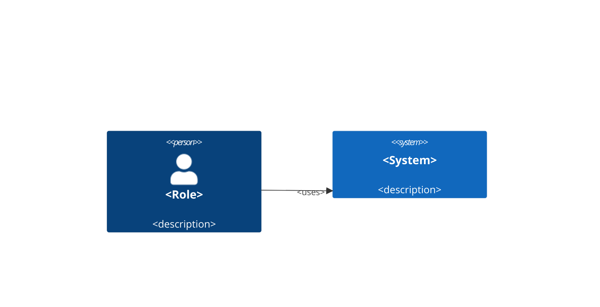
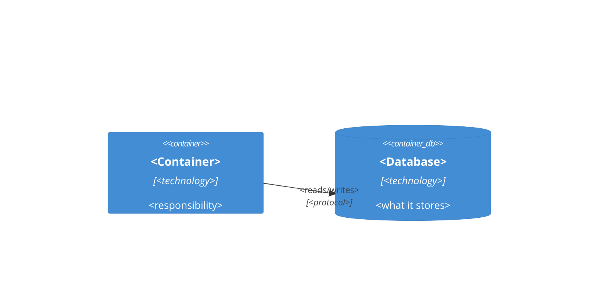

# <Mission title — one line, imperative>

> Mission: M-<slug>

## Summary
<1–2 lines: what this feature is, at epic level>

## Business goal
<why this exists and how success is measured; every industry-standard
claim cites `doc-id §section`>

## Scope
**In scope:** <what this mission covers>
**Out of scope:** <what it deliberately does not>

## System context (C4 L1)


## Containers (C4 L2)


## Constraints & assumptions
<constraints, open questions, and any detail that would need code
knowledge — mark those `%%TODO: verify against codebase%%`, never invent
them>

## US backlog
| US ID | Title |
|---|---|
| M-<slug>-US1 | <story title> |
| M-<slug>-US2 | <story title> |

## KB context
```yaml
kb-context:
  version: "<hub commit>"
  refs:
    - <repo:doc-id §section>
  tags: [ … ]
```

## Definition of Ready
- [ ] Business goal, scope, L1 + L2 diagrams, backlog present
- [ ] Every citation resolves at the pinned version (kb mission lint PASS)
- [ ] Backlog reviewed with the team; no known missing slice
