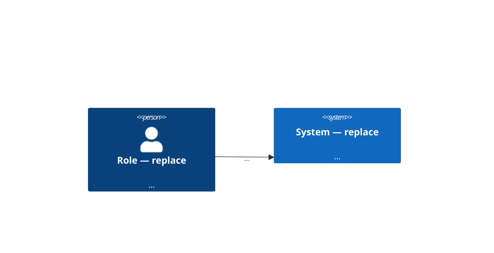
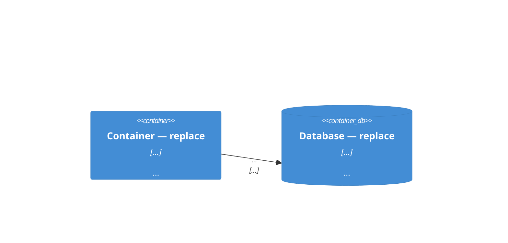

# <Mission title — one line, imperative>

<!-- Mission id format: lowercase letters/digits, hyphen-separated, e.g. M-checkout-v2 -->
> Mission: M-<slug>

## Summary
<1–2 lines: what this feature is, at epic level>

## Business goal
<why this exists and how success is measured; every industry-standard
claim cites `[doc-id §section]`>

## Scope
**In scope:** <what this mission covers>

**Out of scope:** <what it deliberately does not>

## System context (C4 L1)


## Containers (C4 L2)


<!-- Optional: if you have real component detail, add a "## Components (C4 L3)" section with a C4Component mermaid fence. Never invent components. -->

## Technology decisions
<!-- Every `%%TODO: verify against codebase%%` in the C4 sections has
exactly one row here. A placeholder without an owner means the mission
is not ready, even when lint passes. Status is OPEN or DECIDED. The SA
appends rows here for services, tables and routes the mission will
create; tickets reference them as [NEW: D<n>]. Only a human flips OPEN
to DECIDED. The example rows warn as ownerless in `kb mission lint`
until you fill them in. -->
| # | Decision | Status | Owner | Blocks |
|---|---|---|---|---|
| D1 | <e.g. storage engine choice> | OPEN | <who> | <US id> |
| D2 | New svc.<name> — <one line> | OPEN | <SA / tech lead> | <US id> |

## Non-functional requirements
<!-- At least one quantified NFR is mandatory when the mission touches
large data volumes, concurrency, or real-time constraints.
Unsettled → `OPEN(<owner>)`, never blank. -->
| Concern | Target | How to measure | Source |
|---|---|---|---|

## Constraints & assumptions
<constraints and any detail that would need code knowledge — mark those
`%%TODO: verify against codebase%%`, never invent them. Questions that
need an answer go to `## Open questions`, not here.>

## US backlog
| US ID | Title |
|---|---|
| M-<slug>-US1 | <story title> |
| M-<slug>-US2 | <story title> |

## Sequencing
<!-- Separate section on purpose: the `## US backlog` header row
'| US ID | Title |' is matched verbatim by lint — never add columns. -->
| US ID | Depends on | Size | Notes |
|---|---|---|---|

## Services & order
<!-- SA-owned — filled by /sa-ticket-ground --mission from the hub's
<repo>-code document. Capability layer only: one row per service this
mission touches, by its svc.<name> id; "Depends on" is copied from that
record's own `Depends on` cell. No file names, no function names,
no tables, no routes — those belong in each ticket's Technical grounding
section. A service the mission will create carries [NEW: D<n>], naming
its row in Technology decisions above. One marker exempts every unknown
svc.* on its row, "Depends on" included, so the marker goes on the new
service only — keep "Depends on" to services that already exist or
carry their own decision row. -->
- Grounded on: <repo-id>:<repo-id>-code @ <revision>

| Order | Service | Depends on | Why this order |
|---|---|---|---|
| 1 | svc.<name> | <from record> | <reason, cites the dependency> |
| 2 | svc.<new-name> [NEW: D<n>] | svc.<name> | <reason> |

## Open questions
<!-- Architecture-changing questions are flagged here and must be
closed BEFORE foundational stories start. -->
- [ ] Q1 — <question> — owner: <who> — impact: <architecture / scope / cost> — blocks: <US id>

## KB context
```yaml
kb-context:
  version: "<hub commit>"
  refs:
    - <repo:doc-id> §<section>
  tags: [ … ]
```

## Definition of Ready
- [ ] Business goal, scope, L1 + L2 diagrams, backlog present
- [ ] Every citation resolves at the pinned version (kb mission lint PASS)
- [ ] Backlog reviewed with the team; no known missing slice
- [ ] Every `%%TODO%%` has an owned row in Technology decisions
- [ ] Sequencing covers the whole backlog
- [ ] Architecture-impacting open questions closed

## Review record
<!-- Filled by the maturity-review step (rubric: docs/review-rubric.md).
One row per review round; re-reviews append rows — keep the history.
Score = lowest maturity level fully satisfied; threshold is 4 per axis.
Gaps still open after the review are listed below the table and each
must have an owned row under Open questions. -->
Not yet reviewed.

| Date | Round | Business | Dev | Reviewer |
|---|---|---|---|---|

Open gaps: <none, or Q-ids with owners>
